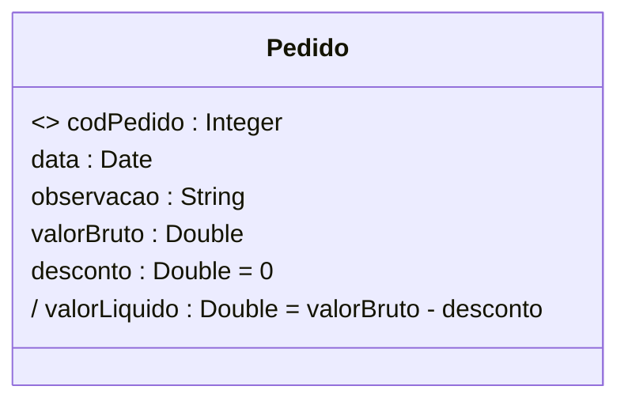
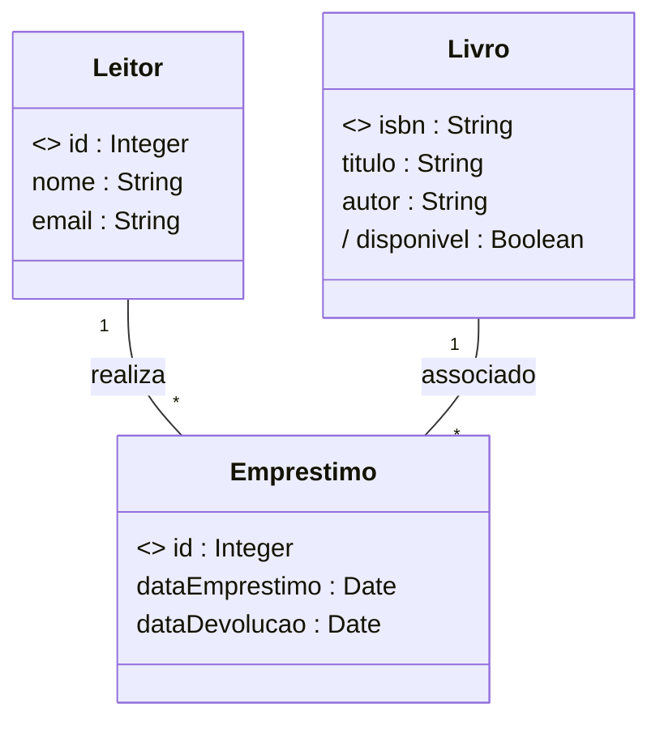

# Modelagem de Dados UML (Análise&Projeto Orientado a Objetos)

https://www.udemy.com/course/uml-diagrama-de-classes/

Curso completo de modelagem conceitual com UML. Teoria e prática! Bônus: projeto Java, Spring Boot e Hibernate/JPA

## <a name="indice">Índice</a>

1. [Seção 1 - Introdução](#parte1)     
2. [Seção 2 - Identificação de conceitos e atributos](#parte2)     
3. [Seção 3 - Associações e multiplicidades de papéis](#parte3)     
4. [Seção 4 - Associações todo-parte e classes de associação](#parte4)     
5. [Seção 5 - Herança, Enumerações e Tipos Primitivos](#parte5)     
6. [Seção 6 - Estudo de caso: Implementação Java com Spring Boot e JPA](#parte6)     
7. [Seção 7 - Seção bônus](#parte7)     
---

## <a name="parte1">1 - Seção 1 - Introdução</a>

### 1 Visão geral do curso

### 2 Material de apoio do capítulo

- [01-A01+Entendendo+modelagem+de+domínio+e+modelagem+conceitual.pdf](/Secao-01-Introducao/00-apoio/01-A01+Entendendo+modelagem+de+domínio+e+modelagem+conceitual.pdf)

### 3 Entendendo Modelagem de Domínio e Modelagem Conceitual

[Voltar ao Índice](#indice)

---

## <a name="parte2">2 - Seção 2 - Identificação de conceitos e atributos</a>

### 04 Material de apoio do capítulo

- [02-A01+Modelo+conceitual,+conceitos+e+atributos.pdf](/Secao-02-Identificacao-de-conceitos-e-atributos/01-apoio/02-A01+Modelo+conceitual,+conceitos+e+atributos.pdf)

- [02-A02+Como+identificar+conceitos.pdf](/Secao-02-Identificacao-de-conceitos-e-atributos/01-apoio/02-A02+Como+identificar+conceitos.pdf)

### 05 Modelo conceitual, conceitos e atributos

Definição 1: é um modelo que descreve a estrutura das informações que o sistema vai gerenciar (Wazlawick)
- Definição 2: é o Modelo de Domínio em nível de Análise:
- Pertence ao escopo do problema e não ao escopo da solução
- Independente de paradigma
- Independente de tecnologia

* Modelo de domínio: modelo que descreve as entidades do domínio, bem como as interrelações entre elas.

- Para representar o Modelo Conceitual, vamos utilizar a ferramenta:
- Diagrama de Classes da UML

- O Modelo Conceitual descreve:
  - Conceitos
  - Atributos
  - Associações

Conceitos: 

- Um conceito pode ser qualquer entidade que tenha um significado para o sistema e que tenha uma necessidade de armazenamento de dados.
  - Exemplos: cliente, pedido, produto, fornecedor, etc.
- Um conceito deve ser uma unidade coesa. (Não se deve misturar informações de várias coisas distintas em um mesmo conceito)
  
Atributos
- Informações alfanuméricas simples, como números, textos, datas, etc. contidas em cada conceito.### 06 Como identificar conceitos
  - Produto: descrição, preço
  - Cliente: nome, email, telefone, CPF, dataNascimento

- Notas (1FN):
  - Não pode ser multivalorado
    - RUIM: telefones ("3736-3938, 9988-3346, 3210-3939")
  - Não pode ser composto
    - RUIM: endereço ("Rua Floriano Peixoto, n° 250, apto 302, Bairro Copacabana, CEP 38410-384")
    - BOM: logradouro, numero, complemento, bairro, cep

---

#### Resumo da IA (DeepSeek)

## 1. O que é um Modelo Conceitual?

### Definição
O **Modelo Conceitual** é uma representação abstrata das **informações que o sistema deve gerenciar**, descrevendo:
- **Entidades** (conceitos do negócio)
- **Atributos** (propriedades dessas entidades)
- **Relacionamentos** (como as entidades se conectam)

### Características Principais
✅ **Modelo de Domínio em Nível de Análise**:
   - Foca no **problema** (não na solução técnica)
   - Exemplo: Em um sistema de e-commerce, o modelo conceitual define `Cliente`, `Produto` e `Pedido`, mas não como serão implementados

✅ **Independente de Tecnologia e Paradigma**:
   - Não assume se será OO, relacional ou funcional
   - Exemplo: O conceito `Pagamento` pode virar uma classe (Java), uma tabela (SQL) ou um documento (MongoDB)

✅ **Pertence ao Escopo do Problema**:
   - Representa **o que o sistema precisa saber**, não **como fará isso**

---

## 2. Conceitos no Modelo Conceitual

### Definição
Um **conceito** é algo que:
- Tem **significado para o negócio**
- Precisa ser **armazenado ou gerenciado** pelo sistema
- É uma **unidade coesa** (não pode ser dividido sem perder sentido)

### Exemplos
✔ **Boas Práticas** (Conceitos bem definidos):
- `Cliente` (em um sistema de vendas)
- `Consulta` (em um sistema médico)
- `Livro` (em uma biblioteca)

✖ **Más Práticas** (Conceitos mal definidos):
- `ProcessarPedido` (não é um conceito, é uma ação → deveria ser um **caso de uso**)
- `DadosDoUsuario` (muito vago → deve ser dividido em `Usuário`, `Perfil`, `Endereço`)

---

## 3. Atributos no Modelo Conceitual

### Definição
Um **atributo** é uma informação **simples e atômica** (não pode ser dividida) associada a um conceito.

### Regras Básicas (1FN - Primeira Forma Normal)
✅ **Não pode ser multivalorado**:
   - ✖ `telefones: [String]` (lista) → ✔ `telefone: String` (e relacionar com uma nova classe `Telefone` se necessário)
   
✅ **Não pode ser composto**:
   - ✖ `endereco: {rua, cidade, CEP}` → ✔ separar em `rua: String`, `cidade: String`, `CEP: String`

### Tipos de Atributos em UML

| Tipo               | Exemplo                     | Notação UML            |
|--------------------|-----------------------------|------------------------|
| **Atributo Simples** | `nome: String`             | `nome: String`         |
| **Identificador (OID)** | `<<oid>> id: Integer`   | `<<oid>> id: Integer`  |
| **Valor Inicial**   | `desconto: Double = 0`     | `desconto: Double = 0` |
| **Atributo Derivado** | `/ valorLiquido: Double`  | `/ valorLiquido: Double` |

### Exemplo Prático (Classe `Pedido`)

**Explicação**:
- `codPedido` é o **identificador único** (`<<oid>>`)
- `desconto` tem **valor inicial 0**
- `valorLiquido` é **derivado** (calculado a partir de outros atributos)

---

## 4. Representação em UML (Diagrama de Classes)

### Boas Práticas
✔ **Nomes claros e no singular** (`Pedido`, não `Pedidos`)  
✔ **Atributos atômicos** (evitar composição)  
✔ **Relacionamentos explícitos**:
- Ex: `Cliente "1" -- "*" Pedido : realiza`

### Más Práticas
✖ **Misturar conceitos e regras de negócio**:
- Ex: Adicionar `calcularTotal()` no modelo conceitual (isso é **design**, não análise)
  ✖ **Usar tipos complexos**:
- Ex: `endereco: Endereço` (melhor decompor em `rua`, `cidade`, etc.)

---

## 5. Exemplo Completo (Sistema de Biblioteca)

### Modelo Conceitual

**Observações**:
- `disponivel` é **derivado** (depende do estado dos empréstimos)
- Não há métodos como `renovarEmprestimo()` (isso seria parte do **modelo de design**)

---

## 6. Referências
- **Wazlawick, R. S.** - *Análise e Projeto de Sistemas de Informação Orientados a Objetos* (2017)
- **Fowler, Martin** - *UML Essencial* (3ª ed.)
- **Evans, Eric** - *Domain-Driven Design* (2004)

Se precisar de mais exemplos ou esclarecimentos, é só perguntar!

### 07 Exercícios de fixação

### 08 Instalação do Astah

### 09 Exercício resolvido 1

### 10 Correção do exercício 2

### 11 Correção do exercício 3

[Voltar ao Índice](#indice)

---

## <a name="parte3">3 - Seção 3 - Associações e multiplicidades de papéis</a>

[Voltar ao Índice](#indice)

---

## <a name="parte4">4 - Seção 4 - Associações todo-parte e classes de associação</a>

[Voltar ao Índice](#indice)

---

## <a name="parte5">5 - Seção 5 - Herança, Enumerações e Tipos Primitivos</a>

[Voltar ao Índice](#indice)

---

## <a name="parte6">6 - Seção 6 - Estudo de caso: Implementação Java com Spring Boot e JPA</a>

[Voltar ao Índice](#indice)

---

## <a name="parte7">7 - Seção 7 - Seção bônus</a>

[Voltar ao Índice](#indice)

---
