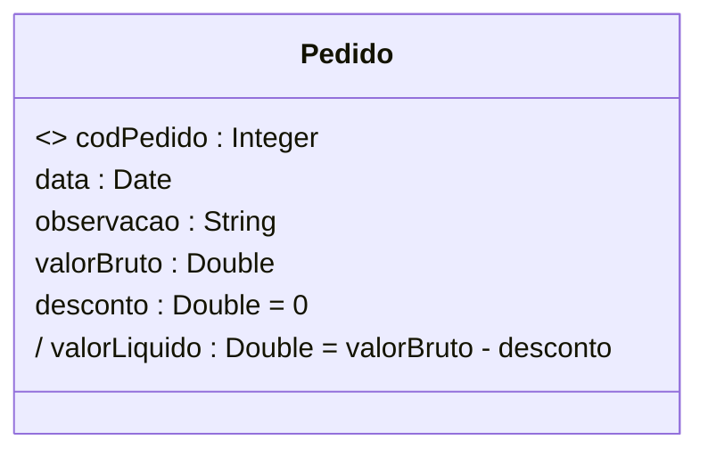
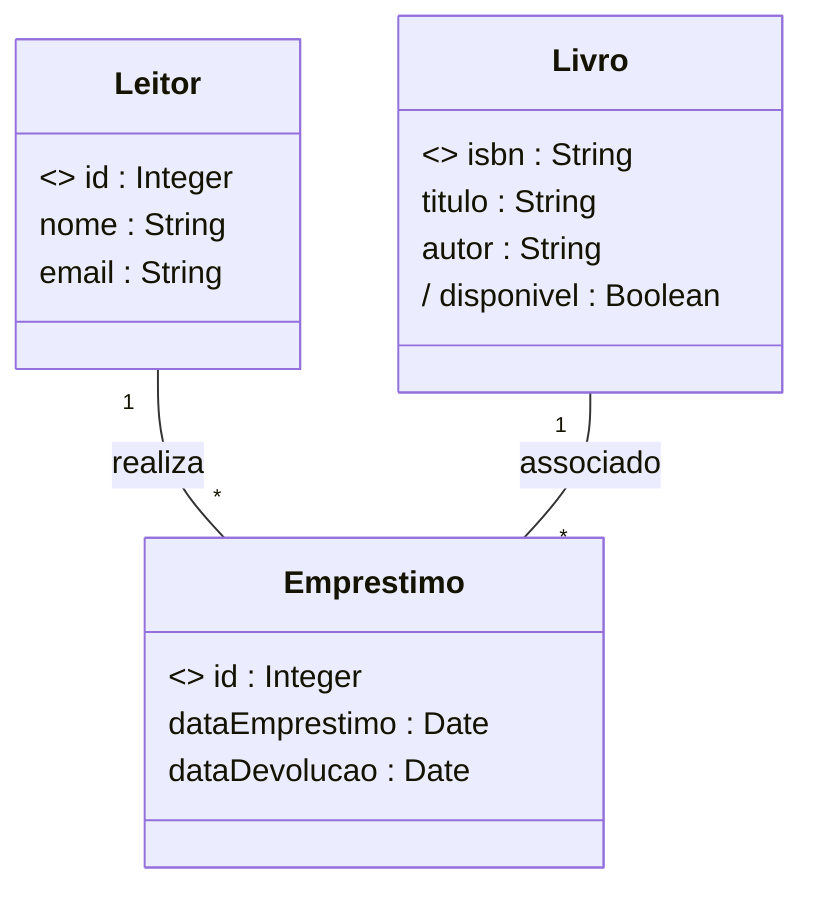
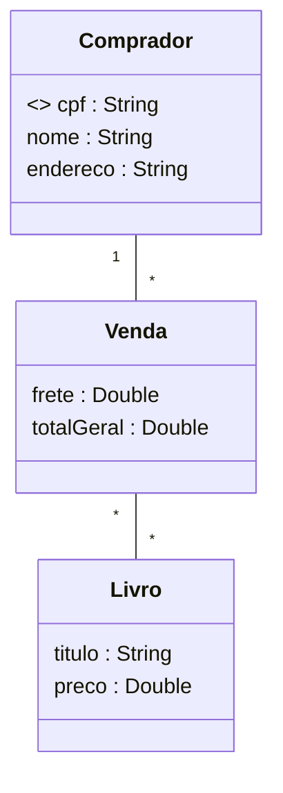

# Modelagem de Dados UML (Análise&Projeto Orientado a Objetos)

https://www.udemy.com/course/uml-diagrama-de-classes/

Curso completo de modelagem conceitual com UML. Teoria e prática! Bônus: projeto Java, Spring Boot e Hibernate/JPA

## <a name="indice">Índice</a>

1. [Seção 1 - Introdução](#parte1)     
2. [Seção 2 - Identificação de conceitos e atributos](#parte2)     
3. [Seção 3 - Associações e multiplicidades de papéis](#parte3)     
4. [Seção 4 - Associações todo-parte e classes de associação](#parte4)     
5. [Seção 5 - Herança, Enumerações e Tipos Primitivos](#parte5)     
6. [Seção 6 - Estudo de caso: Implementação Java com Spring Boot e JPA](#parte6)     
7. [Seção 7 - Seção bônus](#parte7)     
---


## <a name="parte1">1 - Seção 1 - Introdução</a>

### 1 Visão geral do curso


### 2 Material de apoio do capítulo

- [01-A01+Entendendo+modelagem+de+domínio+e+modelagem+conceitual.pdf](/Secao-01-Introducao/00-apoio/01-A01+Entendendo+modelagem+de+domínio+e+modelagem+conceitual.pdf)

### 3 Entendendo Modelagem de Domínio e Modelagem Conceitual


[Voltar ao Índice](#indice)

---


## <a name="parte2">2 - Seção 2 - Identificação de conceitos e atributos</a>

### 04 Material de apoio do capítulo

- [02-A01+Modelo+conceitual,+conceitos+e+atributos.pdf](/Secao-02-Identificacao-de-conceitos-e-atributos/01-apoio/02-A01+Modelo+conceitual,+conceitos+e+atributos.pdf)

- [02-A02+Como+identificar+conceitos.pdf](/Secao-02-Identificacao-de-conceitos-e-atributos/01-apoio/02-A02+Como+identificar+conceitos.pdf)


### 05 Modelo conceitual, conceitos e atributos

Definição 1: é um modelo que descreve a estrutura das informações que o sistema vai gerenciar (Wazlawick)
- Definição 2: é o Modelo de Domínio em nível de Análise:
- Pertence ao escopo do problema e não ao escopo da solução
- Independente de paradigma
- Independente de tecnologia

* Modelo de domínio: modelo que descreve as entidades do domínio, bem como as interrelações entre elas.

- Para representar o Modelo Conceitual, vamos utilizar a ferramenta:
- Diagrama de Classes da UML

- O Modelo Conceitual descreve:
  - Conceitos
  - Atributos
  - Associações


Conceitos: 

- Um conceito pode ser qualquer entidade que tenha um significado para o sistema e que tenha uma necessidade de armazenamento de dados.
  - Exemplos: cliente, pedido, produto, fornecedor, etc.
- Um conceito deve ser uma unidade coesa. (Não se deve misturar informações de várias coisas distintas em um mesmo conceito)
  
Atributos
- Informações alfanuméricas simples, como números, textos, datas, etc. contidas em cada conceito.### 06 Como identificar conceitos
  - Produto: descrição, preço
  - Cliente: nome, email, telefone, CPF, dataNascimento


- Notas (1FN):
  - Não pode ser multivalorado
    - RUIM: telefones ("3736-3938, 9988-3346, 3210-3939")
  - Não pode ser composto
    - RUIM: endereço ("Rua Floriano Peixoto, n° 250, apto 302, Bairro Copacabana, CEP 38410-384")
    - BOM: logradouro, numero, complemento, bairro, cep

---

#### Resumo da IA (DeepSeek)

## 1. O que é um Modelo Conceitual?

### Definição
O **Modelo Conceitual** é uma representação abstrata das **informações que o sistema deve gerenciar**, descrevendo:
- **Entidades** (conceitos do negócio)
- **Atributos** (propriedades dessas entidades)
- **Relacionamentos** (como as entidades se conectam)

### Características Principais
✅ **Modelo de Domínio em Nível de Análise**:
   - Foca no **problema** (não na solução técnica)
   - Exemplo: Em um sistema de e-commerce, o modelo conceitual define `Cliente`, `Produto` e `Pedido`, mas não como serão implementados

✅ **Independente de Tecnologia e Paradigma**:
   - Não assume se será OO, relacional ou funcional
   - Exemplo: O conceito `Pagamento` pode virar uma classe (Java), uma tabela (SQL) ou um documento (MongoDB)

✅ **Pertence ao Escopo do Problema**:
   - Representa **o que o sistema precisa saber**, não **como fará isso**

---

## 2. Conceitos no Modelo Conceitual

### Definição
Um **conceito** é algo que:
- Tem **significado para o negócio**
- Precisa ser **armazenado ou gerenciado** pelo sistema
- É uma **unidade coesa** (não pode ser dividido sem perder sentido)

### Exemplos
✔ **Boas Práticas** (Conceitos bem definidos):
- `Cliente` (em um sistema de vendas)
- `Consulta` (em um sistema médico)
- `Livro` (em uma biblioteca)

✖ **Más Práticas** (Conceitos mal definidos):
- `ProcessarPedido` (não é um conceito, é uma ação → deveria ser um **caso de uso**)
- `DadosDoUsuario` (muito vago → deve ser dividido em `Usuário`, `Perfil`, `Endereço`)

---

## 3. Atributos no Modelo Conceitual

### Definição
Um **atributo** é uma informação **simples e atômica** (não pode ser dividida) associada a um conceito.

### Regras Básicas (1FN - Primeira Forma Normal)
✅ **Não pode ser multivalorado**:
   - ✖ `telefones: [String]` (lista) → ✔ `telefone: String` (e relacionar com uma nova classe `Telefone` se necessário)
   
✅ **Não pode ser composto**:
   - ✖ `endereco: {rua, cidade, CEP}` → ✔ separar em `rua: String`, `cidade: String`, `CEP: String`

### Tipos de Atributos em UML

| Tipo               | Exemplo                     | Notação UML            |
|--------------------|-----------------------------|------------------------|
| **Atributo Simples** | `nome: String`             | `nome: String`         |
| **Identificador (OID)** | `<<oid>> id: Integer`   | `<<oid>> id: Integer`  |
| **Valor Inicial**   | `desconto: Double = 0`     | `desconto: Double = 0` |
| **Atributo Derivado** | `/ valorLiquido: Double`  | `/ valorLiquido: Double` |

### Exemplo Prático (Classe `Pedido`)



**Explicação**:
- `codPedido` é o **identificador único** (`<<oid>>`)
- `desconto` tem **valor inicial 0**
- `valorLiquido` é **derivado** (calculado a partir de outros atributos)

---

## 4. Representação em UML (Diagrama de Classes)

### Boas Práticas
✔ **Nomes claros e no singular** (`Pedido`, não `Pedidos`)  
✔ **Atributos atômicos** (evitar composição)  
✔ **Relacionamentos explícitos**:
- Ex: `Cliente "1" -- "*" Pedido : realiza`

### Más Práticas
✖ **Misturar conceitos e regras de negócio**:
- Ex: Adicionar `calcularTotal()` no modelo conceitual (isso é **design**, não análise)
  ✖ **Usar tipos complexos**:
- Ex: `endereco: Endereço` (melhor decompor em `rua`, `cidade`, etc.)

---

## 5. Exemplo Completo (Sistema de Biblioteca)

### Modelo Conceitual


**Observações**:
- `disponivel` é **derivado** (depende do estado dos empréstimos)
- Não há métodos como `renovarEmprestimo()` (isso seria parte do **modelo de design**)

---

## 6. Referências
- **Wazlawick, R. S.** - *Análise e Projeto de Sistemas de Informação Orientados a Objetos* (2017)
- **Fowler, Martin** - *UML Essencial* (3ª ed.)
- **Evans, Eric** - *Domain-Driven Design* (2004)


### 6 Como identificar conceitos

- [02-A02+Como+identificar+conceitos.pdf](/Secao-02-Identificacao-de-conceitos-e-atributos/01-apoio/02-A02+Como+identificar+conceitos.pdf)

---

#### Resumo AI - DEEPSEEK

## 📌 Fontes para Identificação de Conceitos

### 📚 Documentos-chave:
- **Visão geral do sistema** (documento descritivo)
- **Casos de uso** (interações sistema-ator)
- Processos de negócio, regulamentos e leis
- Entrevistas com especialistas do domínio

### Exemplo Prático (Sistema Acadêmico):
```text
"Registram-se cursos (nome, carga horária, valor), turmas (número, data início, vagas) e 
matrículas (data, prestações). Alunos possuem nome, CPF e data nascimento. Avaliações 
registram notas, com aprovação ≥70% da nota prevista."
```

### ✔ Boas Práticas:
- Extrair substantivos: `Curso`, `Turma`, `Matrícula`, `Aluno`, `Avaliação`
- Atributos coerentes: `Curso.cargaHoraria`, `Aluno.cpf`

### ✖ Más Práticas:
- Ignorar relações: Não conectar `Aluno` ↔ `Matrícula`
- Atributos compostos: `endereco: {rua, cidade, CEP}` (viola 1FN)

---

## 🔍 Técnicas de Identificação

### 🎯 Estratégias:
1. **Substantivos** (pessoa, lugar, coisa)
  - Ex: `Livro`, `Comprador`, `Pagamento`
2. **Expressões substantivadas**
  - Ex: "autorização de pagamento" → `AutorizacaoPagamento`
3. **Verbos que geram conceitos**
  - Ex: "realizar venda" → `Venda`

### Exemplo de Caso de Uso (Compra de Livros):
```text
1. Comprador informa identificação
2. Sistema mostra livros (título, capa, preço)
3. Comprador seleciona livros
4.1 Finaliza compra (cartão, endereço, frete)
4.2 Guarda carrinho (prazo de validade)
```

### ✔ Modelo Correto:


### ✖ Erro Comum:
- Incluir atributos de relacionamento como campos:
  ```text
  class Funcionario {
      telefoneDepartamento : String  // Anti-padrão!
  }
  ```
  **Solução correta**: Relacionar com classe `Departamento`

---

## 💡 Lições-Chave

1. **Documentos insuficientes** exigem complementação com entrevistas
2. **Evitar**:
  - Atributos multivalorados (`telefones: List`)
  - Misturar conceitos (ex: `DadosPagamento` vs `Cartao`+`Venda`)
3. **Validar** com especialistas do domínio

## 📚 Referências
- Alves, Nelio. *Modelagem Conceitual com UML* (Udemy, 2017)
- Wazlawick, R.S. *Análise e Projeto de Sistemas* (2011)
- Fowler, M. *UML Essencial* (3ª ed.)

> **Nota**: Exemplos adaptados do material do Prof. Dr. Nelio Alves (https://www.udemy.com/user/nelio-alves)


### 07 Exercícios de fixação

[02-E01+exercicios-fixacao-identificacao-de-conceitos-e-atributos.pdf](Secao-02-Identificacao-de-conceitos-e-atributos/01-apoio/02-E01+exercicios-fixacao-identificacao-de-conceitos-e-atributos.pdf)

Exercício 1 (RESOLVIDO): Deseja-se construir um sistema para manter um registro de artistas musicais e seus álbuns. Cada álbum possui várias músicas, as quais poderão ser consultadas pelo sistema. O sistema também deve permitir a busca de artistas por nome ou nacionalidade. O sistema também deve ser capaz de exibir um relatório dos álbuns de um artista, o qual pode ser ordenado por nome, ano, ou duração total do álbum. Um álbum pode ter a participação de vários artistas, sem distinção. Já a música pode possuir um ou mais autores e intérpretes (todos considerados artistas).

Exercício 2: Deseja-se construir um sistema para gerenciar as informações de campeonatos de handebol, que ocorrem todo ano. Deseja-se saber nome, data de nascimento, gênero e altura dos jogadores de cada time, bem qual deles é o capitão de cada time. Cada partida do campeonato ocorre em um estádio, que possui nome e endereço. Cada time possui seu estádio-sede e, assim, cada partida possui um time mandante (anfitrião) e o time visitante. O sistema deve ser capaz de listar as partidas já ocorridas e não ocorridas de um campeonato. O sistema deve também ser capaz de listar a tabela do campeonato, ordenando os times por classificação, que é calculada em primeiro lugar por saldo de vitórias e em segundo lugar por saldo de gols.

Exercício 3: Deseja-se fazer um sistema de rede social. Nesta rede social, os usuários podem seguir e ser seguidos por outros usuários. O perfil do usuário deve permitir cadastrar nome, email, data de nascimento, website, gênero, telefone e foto do perfil. Os usuários podem fazer postagens de texto em sua própria "linha do tempo" (timeline) da rede social, sendo que podem anexar também fotos às postagens. Uma foto é referenciada pela URI de seu local de armazenamento. As fotos podem ser organizadas em álbuns, sendo que cada álbum possui um título.


### 08 Instalação do Astah


### 09 Exercício resolvido 1


### 10 Correção do exercício 2


### 11 Correção do exercício 3


[Voltar ao Índice](#indice)

---


## <a name="parte3">3 - Seção 3 - Associações e multiplicidades de papéis</a>

### 12 Material de apoio do capítulo

- [03-A01+Associações.pdf](/Secao-03-Associacoes-e-multiplicidades-de-papeis/00-apoio/03-A01+Associações.pdf)
- [03-A02+Multiplicidade+de+papéis.pdf](/Secao-03-Associacoes-e-multiplicidades-de-papeis/00-apoio/03-A02+Multiplicidade+de+papéis.pdf)
- [03-A03+Conceito+dependente,+associações+obrigatórias,+múltiplas+e+autoassociações.pdf](/Secao-03-Associacoes-e-multiplicidades-de-papeis/00-apoio/03-A03+Conceito+dependente,+associações+obrigatórias,+múltiplas+e+autoassociações.pdf)
- [03-A04+Desenhando+instâncias+com+diagrama+de+objetos+da+UML.pdf](/Secao-03-Associacoes-e-multiplicidades-de-papeis/00-apoio/03-A04+Desenhando+instâncias+com+diagrama+de+objetos+da+UML.pdf)

### 13 Associações

Associação é um relacionamento estático entre dois conceitos.


### 14 Multiplicidades de papéis

É a quantidade mínima e máxima de objetos que uma associação permite em cada um de seus papéis.

Exemplo: um carro pode ter quantos donos?
Mínimo: 1
Máximo: 1


Multiplicidades possíveis

"," significa "ou"
".." significa "a"
"*" significa "vários" (sem limite específico)


a) 1 exatamente um
b) 2 exatamente dois
c) 0..1 zero a um
d) 0..* zero ou mais
e) * zero ou mais
f) 1..* um ou mais
g) 2..* dois ou mais
h) 2..5 de dois a cinco
i) 2,5 dois ou cinco
j) 2,5..8 dois ou cinco a oito


Associações comuns


### 15 Conceito dependente, associações obrigatórias, múltiplas e autoassociações

Associação obrigatória

Uma associação é obrigatória se o conceito associado desempenha um papel de multiplicidade mínima maior que zero


- A associação de uma pessoa com carros não é obrigatória. 
- A associação de um carro com dono é obrigatória.


Conceito dependente

Um conceito é dependente se ele possuir pelo menos uma associação obrigatória.


Nota

A UML tem um símbolo que denota dependência de um modo geral, mas que não acrescenta valor prático à modelagem conceitual:


Associações múltiplas


Os nomes de papel devem ser únicos.


Autoassociações

Quando um conceito é associado com ele próprio.


### 16 Desenhando instâncias com o diagrama de objetos da UML

Recordando
- O Modelo Conceitual representa a estrutura dos dados
  - Conceitos/atributos e como eles se inter-relacionam entre si

- Cada ocorrência de um conceito é chamada de instância ou objeto


Pra quê visualizar as instâncias (ou objetos)?
- Ajuda a compreender
- Ajuda a descobrir problemas
- Ferramenta UML: diagrama de objetos


### 17 Exercícios de fixação

- [03-E01+exercicios-fixacao-associacoes-e-multiplicidades.pdf](/Secao-03-Associacoes-e-multiplicidades-de-papeis/00-apoio/03-E01+exercicios-fixacao-associacoes-e-multiplicidades.pdf)

### 18 Exercício resolvido 1

Exercício 1 (RESOLVIDO): Deseja-se construir um sistema para manter um registro de artistas musicais e seus álbuns. Cada álbum possui várias músicas, as quais poderão ser consultadas pelo sistema. O sistema também deve permitir a busca de artistas por nome ou nacionalidade. O sistema também deve ser capaz de exibir um relatório dos álbuns de um artista, o qual pode ser ordenado por nome, ano, ou duração total do álbum. Um álbum pode ter a participação de vários artistas, sem distinção. Já a música pode possuir um ou mais autores e intérpretes (todos considerados artistas).

Instância mínima: 2 artistas, 3 álbuns, 4 músicas


### 19 Exercício resolvido 2

Exercício 2 (RESOLVIDO): Deseja-se construir um sistema para gerenciar as informações de campeonatos de handebol, que ocorrem todo ano. Deseja-se saber nome, data de nascimento, gênero e altura dos jogadores de cada time, bem como qual deles é o capitão de cada time. Cada partida do campeonato ocorre em um estádio, que possui nome e endereço. Cada time possui seu estádio-sede e, assim, cada partida possui um time mandante (anfitrião) e o time visitante. O sistema deve ser capaz de listar as partidas já ocorridas e não ocorridas de um campeonato. O sistema deve também ser capaz de listar a tabela do campeonato, ordenando os times por classificação, que é calculada em primeiro lugar por saldo de vitórias e em segundo lugar por saldo de gols.

Instância mínima: 1 campeonato, 2 partidas, 2 times, 2 jogadores em cada time

- [Secao-03-Associacoes-e-multiplicidades-de-papeis/01-exercicio3](Secao-03-Associacoes-e-multiplicidades-de-papeis/01-exercicio3)


### 20 Correção do exercício 3

Exercício 3: Deseja-se fazer um sistema de rede social. Nesta rede social, os usuários podem seguir e ser seguidos por outros usuários. O perfil do usuário deve permitir cadastrar nome, email, data de nascimento, website, gênero, telefone e foto do perfil. Os usuários podem fazer postagens de texto em sua própria "linha do tempo" (timeline) da rede social, sendo que podem anexar também fotos às postagens. Uma foto é referenciada pela URI de seu local de armazenamento. As fotos podem ser organizadas em álbuns, sendo que cada álbum possui um título.

Instância mínima: 4 usuários, pelo menos um usuário com mais de uma postagem, pelo menos um álbum com mais de uma foto.

- [Secao-03-Associacoes-e-multiplicidades-de-papeis/20-exercicio-3](Secao-03-Associacoes-e-multiplicidades-de-papeis/20-exercicio-3)

### 21 Correção do exercício 4

Exercício 4: Deseja-se construir um sistema para gerenciar as informações dos participantes das atividades de um evento acadêmico. As atividades deste evento podem ser, por exemplo, palestras, cursos, oficinas práticas, etc. Cada atividade que ocorre possui nome, descrição, preço, e pode ser dividida em vários blocos de horários (por exemplo: um curso de HTML pode ocorrer em dois blocos, sendo necessário armazenar o dia e os horários de início de fim do bloco daquele dia). Para cada participante, deseja-se cadastrar seu nome e email.

Instância mínima: 2 atividades, 4 participantes, pelo menos uma atividade com mais de um bloco de horários.

[21-Correcao-do-exercicio-4](Secao-03-Associacoes-e-multiplicidades-de-papeis/21-Correcao-do-exercicio-4)


### 22 Correção do exercício 5

Exercício 5: Deseja-se fazer um sistema para manter dados de cidades (nome, estado, website), onde cada cidade possui um ou mais restaurantes (nome, valor da refeição) e hotéis (nome, valor da diária). Além disso, deseja-se registrar pacotes turísticos vendidos. Para registrar um pacote turístico, deve-se escolher uma cidade, definir a data da viagem, o hotel de hospedagem e o número de dias de permanência. Deve-se também definir se no pacote vai estar incluso ou não um restaurante e, se sim, quantas refeições por dia serão consumidas.

Instância mínima: 1 cidade, 2 hotéis e 2 restaurantes, 2 pacotes turísticos.


[Voltar ao Índice](#indice)

---


## <a name="parte4">4 - Seção 4 - Associações todo-parte e classes de associação</a>


[Voltar ao Índice](#indice)

---


## <a name="parte5">5 - Seção 5 - Herança, Enumerações e Tipos Primitivos</a>


[Voltar ao Índice](#indice)

---


## <a name="parte6">6 - Seção 6 - Estudo de caso: Implementação Java com Spring Boot e JPA</a>


[Voltar ao Índice](#indice)

---


## <a name="parte7">7 - Seção 7 - Seção bônus</a>


[Voltar ao Índice](#indice)

---
