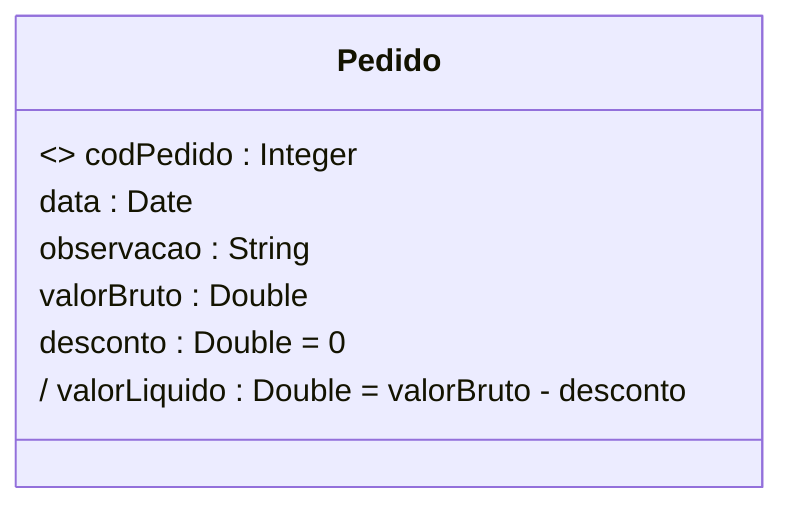
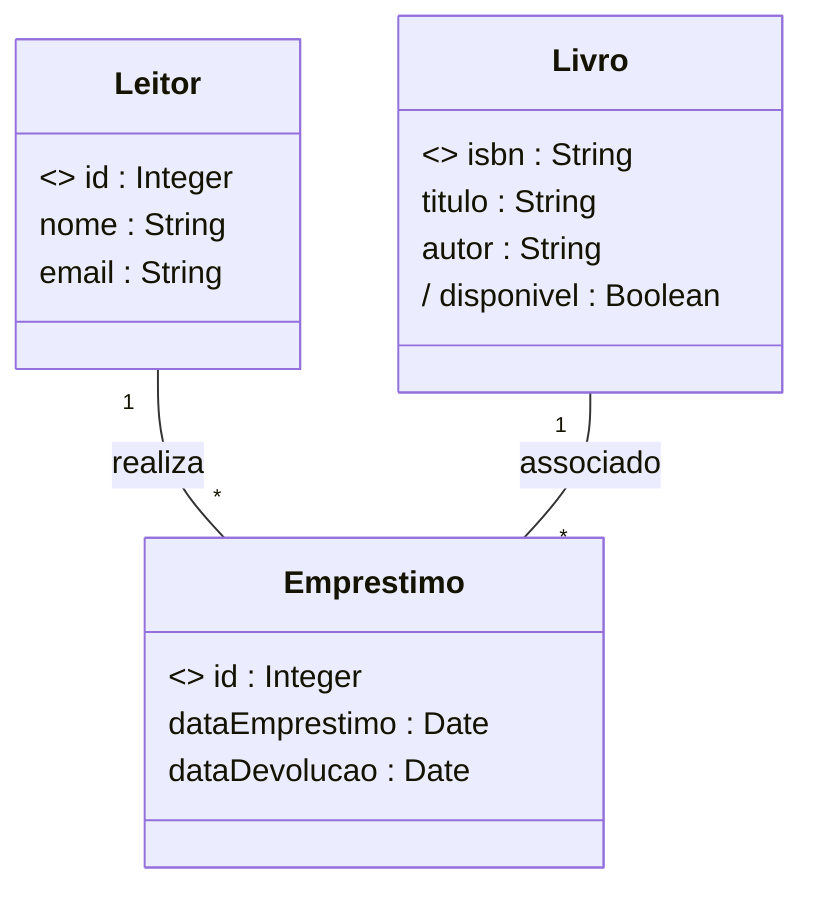
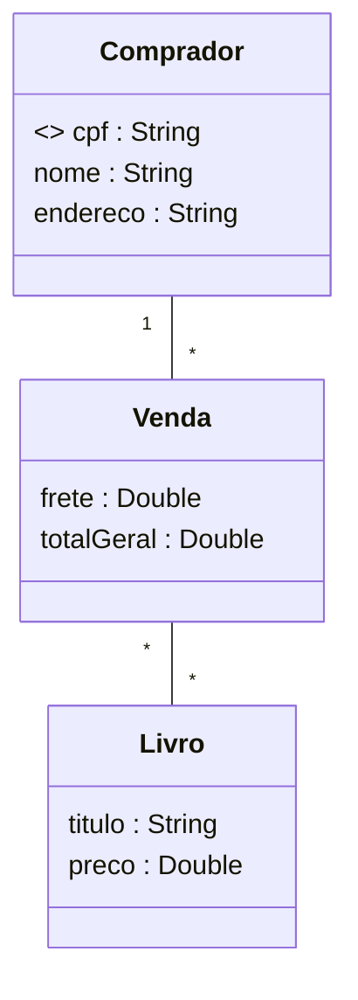

# Modelagem de Dados UML (Análise&Projeto Orientado a Objetos)

https://www.udemy.com/course/uml-diagrama-de-classes/

Curso completo de modelagem conceitual com UML. Teoria e prática! Bônus: projeto Java, Spring Boot e Hibernate/JPA

## <a name="indice">Índice</a>

1. [Seção 1 - Introdução](#parte1)     
2. [Seção 2 - Identificação de conceitos e atributos](#parte2)     
3. [Seção 3 - Associações e multiplicidades de papéis](#parte3)     
4. [Seção 4 - Associações todo-parte e classes de associação](#parte4)     
5. [Seção 5 - Herança, Enumerações e Tipos Primitivos](#parte5)     
6. [Seção 6 - Estudo de caso: Implementação Java com Spring Boot e JPA](#parte6)     
7. [Seção 7 - Seção bônus](#parte7)     
---


## <a name="parte1">1 - Seção 1 - Introdução</a>

### 1 Visão geral do curso


### 2 Material de apoio do capítulo

- [01-A01+Entendendo+modelagem+de+domínio+e+modelagem+conceitual.pdf](/Secao-01-Introducao/00-apoio/01-A01+Entendendo+modelagem+de+domínio+e+modelagem+conceitual.pdf)

### 3 Entendendo Modelagem de Domínio e Modelagem Conceitual


[Voltar ao Índice](#indice)

---


## <a name="parte2">2 - Seção 2 - Identificação de conceitos e atributos</a>

### 04 Material de apoio do capítulo

- [02-A01+Modelo+conceitual,+conceitos+e+atributos.pdf](/Secao-02-Identificacao-de-conceitos-e-atributos/01-apoio/02-A01+Modelo+conceitual,+conceitos+e+atributos.pdf)

- [02-A02+Como+identificar+conceitos.pdf](/Secao-02-Identificacao-de-conceitos-e-atributos/01-apoio/02-A02+Como+identificar+conceitos.pdf)


### 05 Modelo conceitual, conceitos e atributos

Definição 1: é um modelo que descreve a estrutura das informações que o sistema vai gerenciar (Wazlawick)
- Definição 2: é o Modelo de Domínio em nível de Análise:
- Pertence ao escopo do problema e não ao escopo da solução
- Independente de paradigma
- Independente de tecnologia

* Modelo de domínio: modelo que descreve as entidades do domínio, bem como as interrelações entre elas.

- Para representar o Modelo Conceitual, vamos utilizar a ferramenta:
- Diagrama de Classes da UML

- O Modelo Conceitual descreve:
  - Conceitos
  - Atributos
  - Associações


Conceitos: 

- Um conceito pode ser qualquer entidade que tenha um significado para o sistema e que tenha uma necessidade de armazenamento de dados.
  - Exemplos: cliente, pedido, produto, fornecedor, etc.
- Um conceito deve ser uma unidade coesa. (Não se deve misturar informações de várias coisas distintas em um mesmo conceito)
  
Atributos
- Informações alfanuméricas simples, como números, textos, datas, etc. contidas em cada conceito.### 06 Como identificar conceitos
  - Produto: descrição, preço
  - Cliente: nome, email, telefone, CPF, dataNascimento


- Notas (1FN):
  - Não pode ser multivalorado
    - RUIM: telefones ("3736-3938, 9988-3346, 3210-3939")
  - Não pode ser composto
    - RUIM: endereço ("Rua Floriano Peixoto, n° 250, apto 302, Bairro Copacabana, CEP 38410-384")
    - BOM: logradouro, numero, complemento, bairro, cep

---

#### Resumo da IA (DeepSeek)

## 1. O que é um Modelo Conceitual?

### Definição
O **Modelo Conceitual** é uma representação abstrata das **informações que o sistema deve gerenciar**, descrevendo:
- **Entidades** (conceitos do negócio)
- **Atributos** (propriedades dessas entidades)
- **Relacionamentos** (como as entidades se conectam)

### Características Principais
✅ **Modelo de Domínio em Nível de Análise**:
   - Foca no **problema** (não na solução técnica)
   - Exemplo: Em um sistema de e-commerce, o modelo conceitual define `Cliente`, `Produto` e `Pedido`, mas não como serão implementados

✅ **Independente de Tecnologia e Paradigma**:
   - Não assume se será OO, relacional ou funcional
   - Exemplo: O conceito `Pagamento` pode virar uma classe (Java), uma tabela (SQL) ou um documento (MongoDB)

✅ **Pertence ao Escopo do Problema**:
   - Representa **o que o sistema precisa saber**, não **como fará isso**

---

## 2. Conceitos no Modelo Conceitual

### Definição
Um **conceito** é algo que:
- Tem **significado para o negócio**
- Precisa ser **armazenado ou gerenciado** pelo sistema
- É uma **unidade coesa** (não pode ser dividido sem perder sentido)

### Exemplos
✔ **Boas Práticas** (Conceitos bem definidos):
- `Cliente` (em um sistema de vendas)
- `Consulta` (em um sistema médico)
- `Livro` (em uma biblioteca)

✖ **Más Práticas** (Conceitos mal definidos):
- `ProcessarPedido` (não é um conceito, é uma ação → deveria ser um **caso de uso**)
- `DadosDoUsuario` (muito vago → deve ser dividido em `Usuário`, `Perfil`, `Endereço`)

---

## 3. Atributos no Modelo Conceitual

### Definição
Um **atributo** é uma informação **simples e atômica** (não pode ser dividida) associada a um conceito.

### Regras Básicas (1FN - Primeira Forma Normal)
✅ **Não pode ser multivalorado**:
   - ✖ `telefones: [String]` (lista) → ✔ `telefone: String` (e relacionar com uma nova classe `Telefone` se necessário)
   
✅ **Não pode ser composto**:
   - ✖ `endereco: {rua, cidade, CEP}` → ✔ separar em `rua: String`, `cidade: String`, `CEP: String`

### Tipos de Atributos em UML

| Tipo               | Exemplo                     | Notação UML            |
|--------------------|-----------------------------|------------------------|
| **Atributo Simples** | `nome: String`             | `nome: String`         |
| **Identificador (OID)** | `<<oid>> id: Integer`   | `<<oid>> id: Integer`  |
| **Valor Inicial**   | `desconto: Double = 0`     | `desconto: Double = 0` |
| **Atributo Derivado** | `/ valorLiquido: Double`  | `/ valorLiquido: Double` |

### Exemplo Prático (Classe `Pedido`)



**Explicação**:
- `codPedido` é o **identificador único** (`<<oid>>`)
- `desconto` tem **valor inicial 0**
- `valorLiquido` é **derivado** (calculado a partir de outros atributos)

---

## 4. Representação em UML (Diagrama de Classes)

### Boas Práticas
✔ **Nomes claros e no singular** (`Pedido`, não `Pedidos`)  
✔ **Atributos atômicos** (evitar composição)  
✔ **Relacionamentos explícitos**:
- Ex: `Cliente "1" -- "*" Pedido : realiza`

### Más Práticas
✖ **Misturar conceitos e regras de negócio**:
- Ex: Adicionar `calcularTotal()` no modelo conceitual (isso é **design**, não análise)
  ✖ **Usar tipos complexos**:
- Ex: `endereco: Endereço` (melhor decompor em `rua`, `cidade`, etc.)

---

## 5. Exemplo Completo (Sistema de Biblioteca)

### Modelo Conceitual


**Observações**:
- `disponivel` é **derivado** (depende do estado dos empréstimos)
- Não há métodos como `renovarEmprestimo()` (isso seria parte do **modelo de design**)

---

## 6. Referências
- **Wazlawick, R. S.** - *Análise e Projeto de Sistemas de Informação Orientados a Objetos* (2017)
- **Fowler, Martin** - *UML Essencial* (3ª ed.)
- **Evans, Eric** - *Domain-Driven Design* (2004)


### 6 Como identificar conceitos

- [02-A02+Como+identificar+conceitos.pdf](/Secao-02-Identificacao-de-conceitos-e-atributos/01-apoio/02-A02+Como+identificar+conceitos.pdf)

---

#### Resumo AI - DEEPSEEK

## 📌 Fontes para Identificação de Conceitos

### 📚 Documentos-chave:
- **Visão geral do sistema** (documento descritivo)
- **Casos de uso** (interações sistema-ator)
- Processos de negócio, regulamentos e leis
- Entrevistas com especialistas do domínio

### Exemplo Prático (Sistema Acadêmico):
```text
"Registram-se cursos (nome, carga horária, valor), turmas (número, data início, vagas) e 
matrículas (data, prestações). Alunos possuem nome, CPF e data nascimento. Avaliações 
registram notas, com aprovação ≥70% da nota prevista."
```

### ✔ Boas Práticas:
- Extrair substantivos: `Curso`, `Turma`, `Matrícula`, `Aluno`, `Avaliação`
- Atributos coerentes: `Curso.cargaHoraria`, `Aluno.cpf`

### ✖ Más Práticas:
- Ignorar relações: Não conectar `Aluno` ↔ `Matrícula`
- Atributos compostos: `endereco: {rua, cidade, CEP}` (viola 1FN)

---

## 🔍 Técnicas de Identificação

### 🎯 Estratégias:
1. **Substantivos** (pessoa, lugar, coisa)
  - Ex: `Livro`, `Comprador`, `Pagamento`
2. **Expressões substantivadas**
  - Ex: "autorização de pagamento" → `AutorizacaoPagamento`
3. **Verbos que geram conceitos**
  - Ex: "realizar venda" → `Venda`

### Exemplo de Caso de Uso (Compra de Livros):
```text
1. Comprador informa identificação
2. Sistema mostra livros (título, capa, preço)
3. Comprador seleciona livros
4.1 Finaliza compra (cartão, endereço, frete)
4.2 Guarda carrinho (prazo de validade)
```

### ✔ Modelo Correto:


### ✖ Erro Comum:
- Incluir atributos de relacionamento como campos:
  ```text
  class Funcionario {
      telefoneDepartamento : String  // Anti-padrão!
  }
  ```
  **Solução correta**: Relacionar com classe `Departamento`

---

## 💡 Lições-Chave

1. **Documentos insuficientes** exigem complementação com entrevistas
2. **Evitar**:
  - Atributos multivalorados (`telefones: List`)
  - Misturar conceitos (ex: `DadosPagamento` vs `Cartao`+`Venda`)
3. **Validar** com especialistas do domínio

## 📚 Referências
- Alves, Nelio. *Modelagem Conceitual com UML* (Udemy, 2017)
- Wazlawick, R.S. *Análise e Projeto de Sistemas* (2011)
- Fowler, M. *UML Essencial* (3ª ed.)

> **Nota**: Exemplos adaptados do material do Prof. Dr. Nelio Alves (https://www.udemy.com/user/nelio-alves)


### 07 Exercícios de fixação

[02-E01+exercicios-fixacao-identificacao-de-conceitos-e-atributos.pdf](Secao-02-Identificacao-de-conceitos-e-atributos/01-apoio/02-E01+exercicios-fixacao-identificacao-de-conceitos-e-atributos.pdf)

Exercício 1 (RESOLVIDO): Deseja-se construir um sistema para manter um registro de artistas musicais e seus álbuns. Cada álbum possui várias músicas, as quais poderão ser consultadas pelo sistema. O sistema também deve permitir a busca de artistas por nome ou nacionalidade. O sistema também deve ser capaz de exibir um relatório dos álbuns de um artista, o qual pode ser ordenado por nome, ano, ou duração total do álbum. Um álbum pode ter a participação de vários artistas, sem distinção. Já a música pode possuir um ou mais autores e intérpretes (todos considerados artistas).

Exercício 2: Deseja-se construir um sistema para gerenciar as informações de campeonatos de handebol, que ocorrem todo ano. Deseja-se saber nome, data de nascimento, gênero e altura dos jogadores de cada time, bem qual deles é o capitão de cada time. Cada partida do campeonato ocorre em um estádio, que possui nome e endereço. Cada time possui seu estádio-sede e, assim, cada partida possui um time mandante (anfitrião) e o time visitante. O sistema deve ser capaz de listar as partidas já ocorridas e não ocorridas de um campeonato. O sistema deve também ser capaz de listar a tabela do campeonato, ordenando os times por classificação, que é calculada em primeiro lugar por saldo de vitórias e em segundo lugar por saldo de gols.

Exercício 3: Deseja-se fazer um sistema de rede social. Nesta rede social, os usuários podem seguir e ser seguidos por outros usuários. O perfil do usuário deve permitir cadastrar nome, email, data de nascimento, website, gênero, telefone e foto do perfil. Os usuários podem fazer postagens de texto em sua própria "linha do tempo" (timeline) da rede social, sendo que podem anexar também fotos às postagens. Uma foto é referenciada pela URI de seu local de armazenamento. As fotos podem ser organizadas em álbuns, sendo que cada álbum possui um título.


### 08 Instalação do Astah


### 09 Exercício resolvido 1


### 10 Correção do exercício 2


### 11 Correção do exercício 3


[Voltar ao Índice](#indice)

---


## <a name="parte3">3 - Seção 3 - Associações e multiplicidades de papéis</a>

### 12 Material de apoio do capítulo

- [03-A01+Associações.pdf](/Secao-03-Associacoes-e-multiplicidades-de-papeis/00-apoio/03-A01+Associações.pdf)
- [03-A02+Multiplicidade+de+papéis.pdf](/Secao-03-Associacoes-e-multiplicidades-de-papeis/00-apoio/03-A02+Multiplicidade+de+papéis.pdf)
- [03-A03+Conceito+dependente,+associações+obrigatórias,+múltiplas+e+autoassociações.pdf](/Secao-03-Associacoes-e-multiplicidades-de-papeis/00-apoio/03-A03+Conceito+dependente,+associações+obrigatórias,+múltiplas+e+autoassociações.pdf)
- [03-A04+Desenhando+instâncias+com+diagrama+de+objetos+da+UML.pdf](/Secao-03-Associacoes-e-multiplicidades-de-papeis/00-apoio/03-A04+Desenhando+instâncias+com+diagrama+de+objetos+da+UML.pdf)

### 13 Associações


### 14 Multiplicidades de papéis


### 15 Conceito dependente, associações obrigatórias, múltiplas e autoassociações


### 16 Desenhando instâncias com o diagrama de objetos da UML


### 17 Exercícios de fixação


### 18 Exercício resolvido 1


### 19 Exercício resolvido 2


### 20 Correção do exercício 3


### 21 Correção do exercício 4


### 22 Correção do exercício 5


[Voltar ao Índice](#indice)

---


## <a name="parte4">4 - Seção 4 - Associações todo-parte e classes de associação</a>


[Voltar ao Índice](#indice)

---


## <a name="parte5">5 - Seção 5 - Herança, Enumerações e Tipos Primitivos</a>


[Voltar ao Índice](#indice)

---


## <a name="parte6">6 - Seção 6 - Estudo de caso: Implementação Java com Spring Boot e JPA</a>


[Voltar ao Índice](#indice)

---


## <a name="parte7">7 - Seção 7 - Seção bônus</a>


[Voltar ao Índice](#indice)

---
