# Modelagem de Dados UML (Análise&Projeto Orientado a Objetos)

https://www.udemy.com/course/uml-diagrama-de-classes/

Curso completo de modelagem conceitual com UML. Teoria e prática! Bônus: projeto Java, Spring Boot e Hibernate/JPA

## <a name="indice">Índice</a>

1. [Seção 1 - Introdução](#parte1)     
2. [Seção 2 - Identificação de conceitos e atributos](#parte2)     
3. [Seção 3 - Associações e multiplicidades de papéis](#parte3)     
4. [Seção 4 - Associações todo-parte e classes de associação](#parte4)     
5. [Seção 5 - Herança, Enumerações e Tipos Primitivos](#parte5)     
6. [Seção 6 - Estudo de caso: Implementação Java com Spring Boot e JPA](#parte6)     
7. [Seção 7 - Seção bônus](#parte7)     
---


## <a name="parte1">1 - Seção 1 - Introdução</a>

### 1 Visão geral do curso


### 2 Material de apoio do capítulo

- [01-A01+Entendendo+modelagem+de+domínio+e+modelagem+conceitual.pdf](/Secao-01-Introducao/00-apoio/01-A01+Entendendo+modelagem+de+domínio+e+modelagem+conceitual.pdf)

### 3 Entendendo Modelagem de Domínio e Modelagem Conceitual


[Voltar ao Índice](#indice)

---


## <a name="parte2">2 - Seção 2 - Identificação de conceitos e atributos</a>

### 04 Material de apoio do capítulo

- [02-A01+Modelo+conceitual,+conceitos+e+atributos.pdf](/Secao-02-Identificacao-de-conceitos-e-atributos/01-apoio/02-A01+Modelo+conceitual,+conceitos+e+atributos.pdf)

- [02-A02+Como+identificar+conceitos.pdf](/Secao-02-Identificacao-de-conceitos-e-atributos/01-apoio/02-A02+Como+identificar+conceitos.pdf)


### 05 Modelo conceitual, conceitos e atributos

Definição 1: é um modelo que descreve a estrutura das informações que o sistema vai gerenciar (Wazlawick)
- Definição 2: é o Modelo de Domínio em nível de Análise:
- Pertence ao escopo do problema e não ao escopo da solução
- Independente de paradigma
- Independente de tecnologia

* Modelo de domínio: modelo que descreve as entidades do domínio, bem como as interrelações entre elas.

- Para representar o Modelo Conceitual, vamos utilizar a ferramenta:
- Diagrama de Classes da UML

- O Modelo Conceitual descreve:
  - Conceitos
  - Atributos
  - Associações

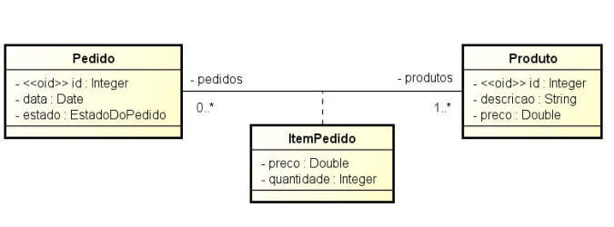


Conceitos: 

- Um conceito pode ser qualquer entidade que tenha um significado para o sistema e que tenha uma necessidade de armazenamento de dados.
  - Exemplos: cliente, pedido, produto, fornecedor, etc.
- Um conceito deve ser uma unidade coesa. (Não se deve misturar informações de várias coisas distintas em um mesmo conceito)
  
Atributos
- Informações alfanuméricas simples, como números, textos, datas, etc. contidas em cada conceito.### 06 Como identificar conceitos
  - Produto: descrição, preço
  - Cliente: nome, email, telefone, CPF, dataNascimento


- Notas (1FN):
  - Não pode ser multivalorado
    - RUIM: telefones ("3736-3938, 9988-3346, 3210-3939")
  - Não pode ser composto
    - RUIM: endereço ("Rua Floriano Peixoto, n° 250, apto 302, Bairro Copacabana, CEP 38410-384")
    - BOM: logradouro, numero, complemento, bairro, cep

---

#### Resumo da IA (DeepSeek)

## 1. O que é um Modelo Conceitual?

### Definição
O **Modelo Conceitual** é uma representação abstrata das **informações que o sistema deve gerenciar**, descrevendo:
- **Entidades** (conceitos do negócio)
- **Atributos** (propriedades dessas entidades)
- **Relacionamentos** (como as entidades se conectam)

### Características Principais
✅ **Modelo de Domínio em Nível de Análise**:
   - Foca no **problema** (não na solução técnica)
   - Exemplo: Em um sistema de e-commerce, o modelo conceitual define `Cliente`, `Produto` e `Pedido`, mas não como serão implementados

✅ **Independente de Tecnologia e Paradigma**:
   - Não assume se será OO, relacional ou funcional
   - Exemplo: O conceito `Pagamento` pode virar uma classe (Java), uma tabela (SQL) ou um documento (MongoDB)

✅ **Pertence ao Escopo do Problema**:
   - Representa **o que o sistema precisa saber**, não **como fará isso**

---

## 2. Conceitos no Modelo Conceitual

### Definição
Um **conceito** é algo que:
- Tem **significado para o negócio**
- Precisa ser **armazenado ou gerenciado** pelo sistema
- É uma **unidade coesa** (não pode ser dividido sem perder sentido)

### Exemplos
✔ **Boas Práticas** (Conceitos bem definidos):
- `Cliente` (em um sistema de vendas)
- `Consulta` (em um sistema médico)
- `Livro` (em uma biblioteca)

✖ **Más Práticas** (Conceitos mal definidos):
- `ProcessarPedido` (não é um conceito, é uma ação → deveria ser um **caso de uso**)
- `DadosDoUsuario` (muito vago → deve ser dividido em `Usuário`, `Perfil`, `Endereço`)

---

## 3. Atributos no Modelo Conceitual

### Definição
Um **atributo** é uma informação **simples e atômica** (não pode ser dividida) associada a um conceito.

### Regras Básicas (1FN - Primeira Forma Normal)
✅ **Não pode ser multivalorado**:
   - ✖ `telefones: [String]` (lista) → ✔ `telefone: String` (e relacionar com uma nova classe `Telefone` se necessário)
   
✅ **Não pode ser composto**:
   - ✖ `endereco: {rua, cidade, CEP}` → ✔ separar em `rua: String`, `cidade: String`, `CEP: String`

### Tipos de Atributos em UML

| Tipo               | Exemplo                     | Notação UML            |
|--------------------|-----------------------------|------------------------|
| **Atributo Simples** | `nome: String`             | `nome: String`         |
| **Identificador (OID)** | `<<oid>> id: Integer`   | `<<oid>> id: Integer`  |
| **Valor Inicial**   | `desconto: Double = 0`     | `desconto: Double = 0` |
| **Atributo Derivado** | `/ valorLiquido: Double`  | `/ valorLiquido: Double` |

### Exemplo Prático (Classe `Pedido`)

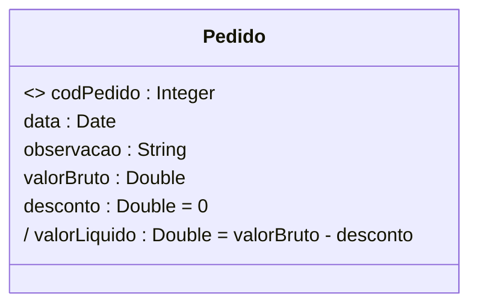

**Explicação**:
- `codPedido` é o **identificador único** (`<<oid>>`)
- `desconto` tem **valor inicial 0**
- `valorLiquido` é **derivado** (calculado a partir de outros atributos)

---

## 4. Representação em UML (Diagrama de Classes)

### Boas Práticas
✔ **Nomes claros e no singular** (`Pedido`, não `Pedidos`)  
✔ **Atributos atômicos** (evitar composição)  
✔ **Relacionamentos explícitos**:
- Ex: `Cliente "1" -- "*" Pedido : realiza`

### Más Práticas
✖ **Misturar conceitos e regras de negócio**:
- Ex: Adicionar `calcularTotal()` no modelo conceitual (isso é **design**, não análise)
  ✖ **Usar tipos complexos**:
- Ex: `endereco: Endereço` (melhor decompor em `rua`, `cidade`, etc.)

---

## 5. Exemplo Completo (Sistema de Biblioteca)

### Modelo Conceitual
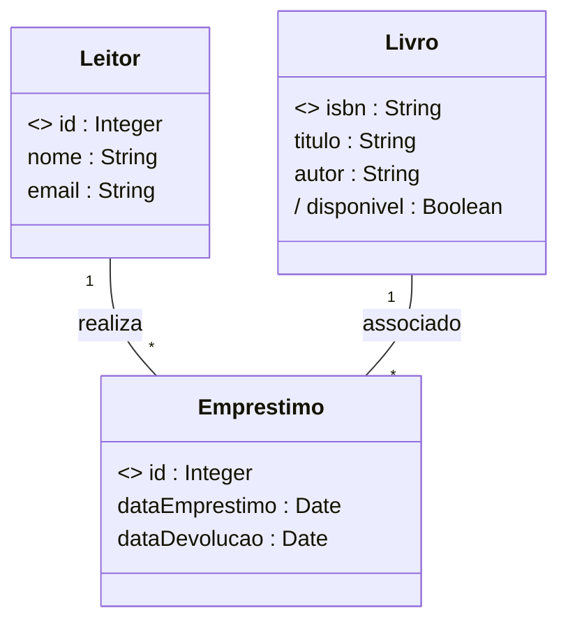

**Observações**:
- `disponivel` é **derivado** (depende do estado dos empréstimos)
- Não há métodos como `renovarEmprestimo()` (isso seria parte do **modelo de design**)

---

## 6. Referências
- **Wazlawick, R. S.** - *Análise e Projeto de Sistemas de Informação Orientados a Objetos* (2017)
- **Fowler, Martin** - *UML Essencial* (3ª ed.)
- **Evans, Eric** - *Domain-Driven Design* (2004)


### 6 Como identificar conceitos

- [02-A02+Como+identificar+conceitos.pdf](/Secao-02-Identificacao-de-conceitos-e-atributos/01-apoio/02-A02+Como+identificar+conceitos.pdf)

---

#### Resumo AI - DEEPSEEK

## 📌 Fontes para Identificação de Conceitos

### 📚 Documentos-chave:
- **Visão geral do sistema** (documento descritivo)
- **Casos de uso** (interações sistema-ator)
- Processos de negócio, regulamentos e leis
- Entrevistas com especialistas do domínio

### Exemplo Prático (Sistema Acadêmico):
```text
"Registram-se cursos (nome, carga horária, valor), turmas (número, data início, vagas) e 
matrículas (data, prestações). Alunos possuem nome, CPF e data nascimento. Avaliações 
registram notas, com aprovação ≥70% da nota prevista."
```

### ✔ Boas Práticas:
- Extrair substantivos: `Curso`, `Turma`, `Matrícula`, `Aluno`, `Avaliação`
- Atributos coerentes: `Curso.cargaHoraria`, `Aluno.cpf`

### ✖ Más Práticas:
- Ignorar relações: Não conectar `Aluno` ↔ `Matrícula`
- Atributos compostos: `endereco: {rua, cidade, CEP}` (viola 1FN)

---

## 🔍 Técnicas de Identificação

### 🎯 Estratégias:
1. **Substantivos** (pessoa, lugar, coisa)
  - Ex: `Livro`, `Comprador`, `Pagamento`
2. **Expressões substantivadas**
  - Ex: "autorização de pagamento" → `AutorizacaoPagamento`
3. **Verbos que geram conceitos**
  - Ex: "realizar venda" → `Venda`

### Exemplo de Caso de Uso (Compra de Livros):
```text
1. Comprador informa identificação
2. Sistema mostra livros (título, capa, preço)
3. Comprador seleciona livros
4.1 Finaliza compra (cartão, endereço, frete)
4.2 Guarda carrinho (prazo de validade)
```

### ✔ Modelo Correto:
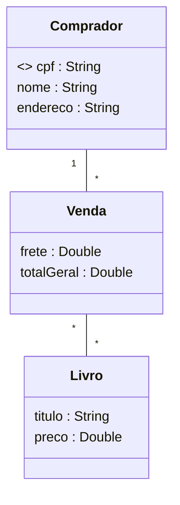

### ✖ Erro Comum:
- Incluir atributos de relacionamento como campos:
  ```text
  class Funcionario {
      telefoneDepartamento : String  // Anti-padrão!
  }
  ```
  **Solução correta**: Relacionar com classe `Departamento`

---

## 💡 Lições-Chave

1. **Documentos insuficientes** exigem complementação com entrevistas
2. **Evitar**:
  - Atributos multivalorados (`telefones: List`)
  - Misturar conceitos (ex: `DadosPagamento` vs `Cartao`+`Venda`)
3. **Validar** com especialistas do domínio

## 📚 Referências
- Alves, Nelio. *Modelagem Conceitual com UML* (Udemy, 2017)
- Wazlawick, R.S. *Análise e Projeto de Sistemas* (2011)
- Fowler, M. *UML Essencial* (3ª ed.)

> **Nota**: Exemplos adaptados do material do Prof. Dr. Nelio Alves (https://www.udemy.com/user/nelio-alves)


### 07 Exercícios de fixação

[02-E01+exercicios-fixacao-identificacao-de-conceitos-e-atributos.pdf](Secao-02-Identificacao-de-conceitos-e-atributos/01-apoio/02-E01+exercicios-fixacao-identificacao-de-conceitos-e-atributos.pdf)

Exercício 1 (RESOLVIDO): Deseja-se construir um sistema para manter um registro de artistas musicais e seus álbuns. Cada álbum possui várias músicas, as quais poderão ser consultadas pelo sistema. O sistema também deve permitir a busca de artistas por nome ou nacionalidade. O sistema também deve ser capaz de exibir um relatório dos álbuns de um artista, o qual pode ser ordenado por nome, ano, ou duração total do álbum. Um álbum pode ter a participação de vários artistas, sem distinção. Já a música pode possuir um ou mais autores e intérpretes (todos considerados artistas).

Exercício 2: Deseja-se construir um sistema para gerenciar as informações de campeonatos de handebol, que ocorrem todo ano. Deseja-se saber nome, data de nascimento, gênero e altura dos jogadores de cada time, bem qual deles é o capitão de cada time. Cada partida do campeonato ocorre em um estádio, que possui nome e endereço. Cada time possui seu estádio-sede e, assim, cada partida possui um time mandante (anfitrião) e o time visitante. O sistema deve ser capaz de listar as partidas já ocorridas e não ocorridas de um campeonato. O sistema deve também ser capaz de listar a tabela do campeonato, ordenando os times por classificação, que é calculada em primeiro lugar por saldo de vitórias e em segundo lugar por saldo de gols.

Exercício 3: Deseja-se fazer um sistema de rede social. Nesta rede social, os usuários podem seguir e ser seguidos por outros usuários. O perfil do usuário deve permitir cadastrar nome, email, data de nascimento, website, gênero, telefone e foto do perfil. Os usuários podem fazer postagens de texto em sua própria "linha do tempo" (timeline) da rede social, sendo que podem anexar também fotos às postagens. Uma foto é referenciada pela URI de seu local de armazenamento. As fotos podem ser organizadas em álbuns, sendo que cada álbum possui um título.


### 08 Instalação do Astah


### 09 Exercício resolvido 1


### 10 Correção do exercício 2


### 11 Correção do exercício 3


[Voltar ao Índice](#indice)

---


## <a name="parte3">3 - Seção 3 - Associações e multiplicidades de papéis</a>

### 12 Material de apoio do capítulo

- [03-A01+Associações.pdf](/Secao-03-Associacoes-e-multiplicidades-de-papeis/00-apoio/03-A01+Associações.pdf)
- [03-A02+Multiplicidade+de+papéis.pdf](/Secao-03-Associacoes-e-multiplicidades-de-papeis/00-apoio/03-A02+Multiplicidade+de+papéis.pdf)
- [03-A03+Conceito+dependente,+associações+obrigatórias,+múltiplas+e+autoassociações.pdf](/Secao-03-Associacoes-e-multiplicidades-de-papeis/00-apoio/03-A03+Conceito+dependente,+associações+obrigatórias,+múltiplas+e+autoassociações.pdf)
- [03-A04+Desenhando+instâncias+com+diagrama+de+objetos+da+UML.pdf](/Secao-03-Associacoes-e-multiplicidades-de-papeis/00-apoio/03-A04+Desenhando+instâncias+com+diagrama+de+objetos+da+UML.pdf)

### 13 Associações

Associação é um relacionamento estático entre dois conceitos.

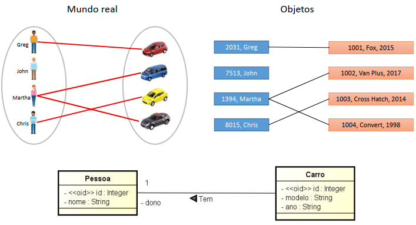

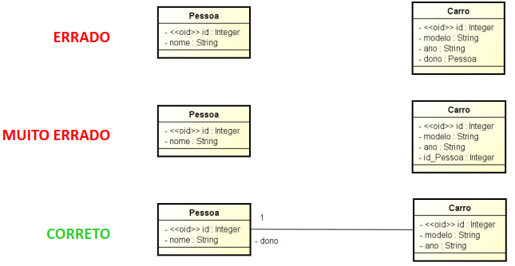


### 14 Multiplicidades de papéis

É a quantidade mínima e máxima de objetos que uma associação permite em cada um de seus papéis.

Exemplo: um carro pode ter quantos donos?
Mínimo: 1
Máximo: 1


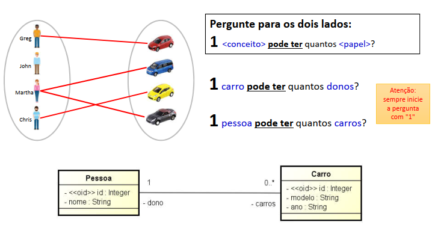


Multiplicidades possíveis

"," significa "ou"
".." significa "a"
"*" significa "vários" (sem limite específico)


a) 1 exatamente um
b) 2 exatamente dois
c) 0..1 zero a um
d) 0..* zero ou mais
e) * zero ou mais
f) 1..* um ou mais
g) 2..* dois ou mais
h) 2..5 de dois a cinco
i) 2,5 dois ou cinco
j) 2,5..8 dois ou cinco a oito


Associações comuns

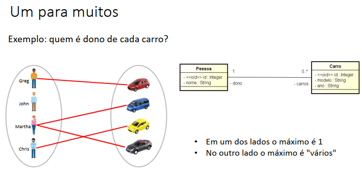

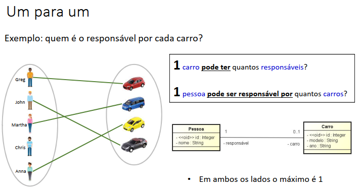

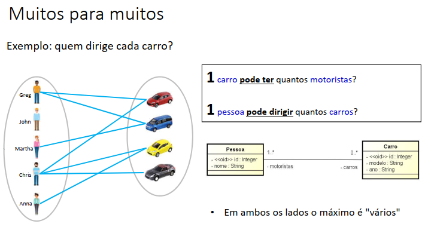


### 15 Conceito dependente, associações obrigatórias, múltiplas e autoassociações

Associação obrigatória

Uma associação é obrigatória se o conceito associado desempenha um papel de multiplicidade mínima maior que zero

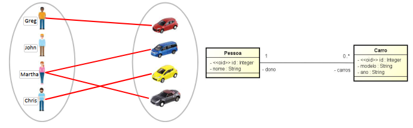

- A associação de uma pessoa com carros não é obrigatória. 
- A associação de um carro com dono é obrigatória.

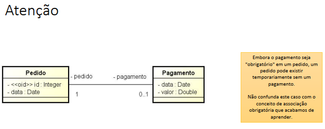


Conceito dependente

Um conceito é dependente se ele possuir pelo menos uma associação obrigatória.

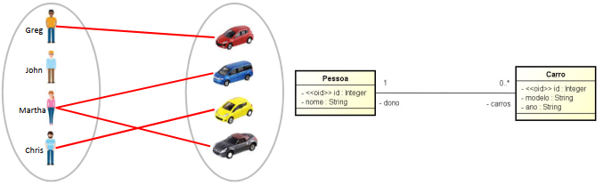

Nota

A UML tem um símbolo que denota dependência de um modo geral, mas que não acrescenta valor prático à modelagem conceitual:

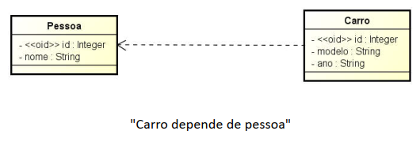


Associações múltiplas

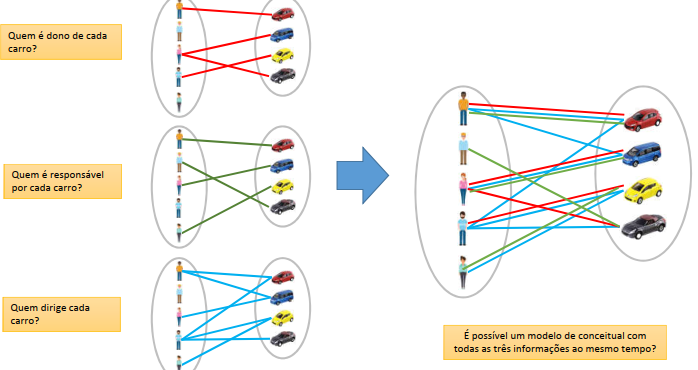

Os nomes de papel devem ser únicos.

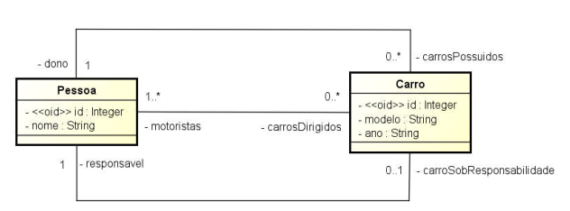

Autoassociações

Quando um conceito é associado com ele próprio.

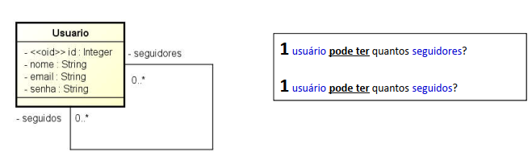

### 16 Desenhando instâncias com o diagrama de objetos da UML

Recordando
- O Modelo Conceitual representa a estrutura dos dados
  - Conceitos/atributos e como eles se inter-relacionam entre si

- Cada ocorrência de um conceito é chamada de instância ou objeto


Pra quê visualizar as instâncias (ou objetos)?
- Ajuda a compreender
- Ajuda a descobrir problemas
- Ferramenta UML: diagrama de objetos


### 17 Exercícios de fixação

- [03-E01+exercicios-fixacao-associacoes-e-multiplicidades.pdf](/Secao-03-Associacoes-e-multiplicidades-de-papeis/00-apoio/03-E01+exercicios-fixacao-associacoes-e-multiplicidades.pdf)

### 18 Exercício resolvido 1

Exercício 1 (RESOLVIDO): Deseja-se construir um sistema para manter um registro de artistas musicais e seus álbuns. Cada álbum possui várias músicas, as quais poderão ser consultadas pelo sistema. O sistema também deve permitir a busca de artistas por nome ou nacionalidade. O sistema também deve ser capaz de exibir um relatório dos álbuns de um artista, o qual pode ser ordenado por nome, ano, ou duração total do álbum. Um álbum pode ter a participação de vários artistas, sem distinção. Já a música pode possuir um ou mais autores e intérpretes (todos considerados artistas).

Instância mínima: 2 artistas, 3 álbuns, 4 músicas

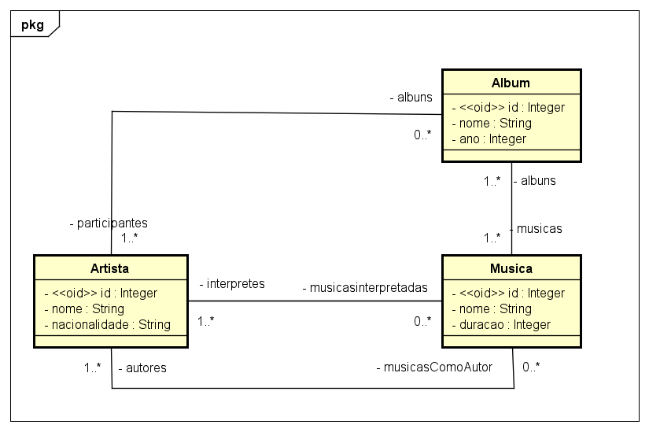

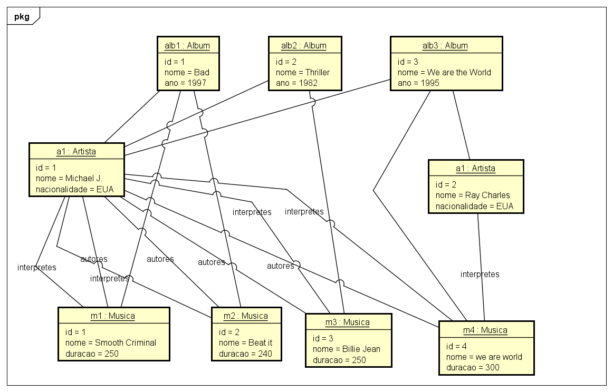


### 19 Exercício resolvido 2

Exercício 2 (RESOLVIDO): Deseja-se construir um sistema para gerenciar as informações de campeonatos de handebol, que ocorrem todo ano. Deseja-se saber nome, data de nascimento, gênero e altura dos jogadores de cada time, bem como qual deles é o capitão de cada time. Cada partida do campeonato ocorre em um estádio, que possui nome e endereço. Cada time possui seu estádio-sede e, assim, cada partida possui um time mandante (anfitrião) e o time visitante. O sistema deve ser capaz de listar as partidas já ocorridas e não ocorridas de um campeonato. O sistema deve também ser capaz de listar a tabela do campeonato, ordenando os times por classificação, que é calculada em primeiro lugar por saldo de vitórias e em segundo lugar por saldo de gols.

Instância mínima: 1 campeonato, 2 partidas, 2 times, 2 jogadores em cada time

- [Secao-03-Associacoes-e-multiplicidades-de-papeis/01-exercicio3](Secao-03-Associacoes-e-multiplicidades-de-papeis/01-exercicio3)


### 20 Correção do exercício 3

Exercício 3: Deseja-se fazer um sistema de rede social. Nesta rede social, os usuários podem seguir e ser seguidos por outros usuários. O perfil do usuário deve permitir cadastrar nome, email, data de nascimento, website, gênero, telefone e foto do perfil. Os usuários podem fazer postagens de texto em sua própria "linha do tempo" (timeline) da rede social, sendo que podem anexar também fotos às postagens. Uma foto é referenciada pela URI de seu local de armazenamento. As fotos podem ser organizadas em álbuns, sendo que cada álbum possui um título.

Instância mínima: 4 usuários, pelo menos um usuário com mais de uma postagem, pelo menos um álbum com mais de uma foto.

- [Secao-03-Associacoes-e-multiplicidades-de-papeis/20-exercicio-3](Secao-03-Associacoes-e-multiplicidades-de-papeis/20-exercicio-3)

### 21 Correção do exercício 4

Exercício 4: Deseja-se construir um sistema para gerenciar as informações dos participantes das atividades de um evento acadêmico. As atividades deste evento podem ser, por exemplo, palestras, cursos, oficinas práticas, etc. Cada atividade que ocorre possui nome, descrição, preço, e pode ser dividida em vários blocos de horários (por exemplo: um curso de HTML pode ocorrer em dois blocos, sendo necessário armazenar o dia e os horários de início de fim do bloco daquele dia). Para cada participante, deseja-se cadastrar seu nome e email.

Instância mínima: 2 atividades, 4 participantes, pelo menos uma atividade com mais de um bloco de horários.

[21-Correcao-do-exercicio-4](Secao-03-Associacoes-e-multiplicidades-de-papeis/21-Correcao-do-exercicio-4)


### 22 Correção do exercício 5

Exercício 5: Deseja-se fazer um sistema para manter dados de cidades (nome, estado, website), onde cada cidade possui um ou mais restaurantes (nome, valor da refeição) e hotéis (nome, valor da diária). Além disso, deseja-se registrar pacotes turísticos vendidos. Para registrar um pacote turístico, deve-se escolher uma cidade, definir a data da viagem, o hotel de hospedagem e o número de dias de permanência. Deve-se também definir se no pacote vai estar incluso ou não um restaurante e, se sim, quantas refeições por dia serão consumidas.

Instância mínima: 1 cidade, 2 hotéis e 2 restaurantes, 2 pacotes turísticos.

[22-Correcao-do-0exercicio-5](Secao-03-Associacoes-e-multiplicidades-de-papeis/22-Correcao-do-0exercicio-5)


[Voltar ao Índice](#indice)

---


## <a name="parte4">4 - Seção 4 - Associações todo-parte e classes de associação</a>


### 23 Material de apoio do capítulo

[04-A01+Associações+todo-parte.pdf](Secao-04-Associacaes-todo-parte-e-classes-de-associacao/00-apoio/04-A01%2BAssocia%C3%A7%C3%B5es%2Btodo-parte.pdf)

[04-A02+Classe+de+associação.pdf](Secao-04-Associacaes-todo-parte-e-classes-de-associacao/00-apoio/04-A02%2BClasse%2Bde%2Bassocia%C3%A7%C3%A3o.pdf)


### 24 Associação todo-parte

Quando um conceito é parte de outro que representa um todo, desenhamos um diamante no lado do todo.

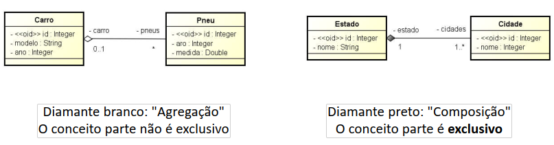

#### Exclusividade: 1 ou 0..1

Como a composição (diamante preto) é uma relação exclusiva, a multiplicidade no lado do diamante sempre será 1 ou 0..1

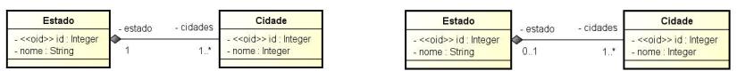

Agregação - exemplo 2

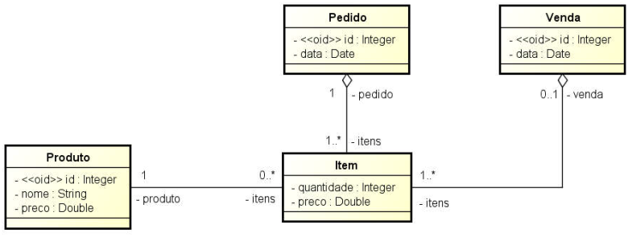

Agregação - exemplo 3

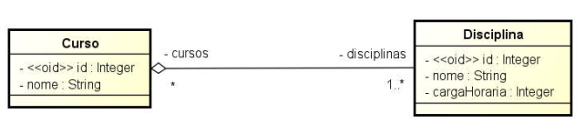

#### Ressalva 1

O diamante (seja branco, seja preto) deve ser usado somente em casos em que realmente se trata de uma relação todo-parte

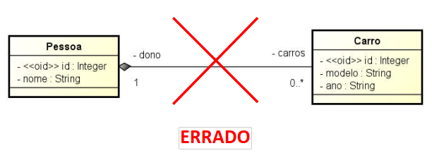


#### Ressalva 2

Algumas pessoas confundem o diamante preto (composição) como se fosse uma forma de indicar a deleção em cascata dos objetos dependentes. Na verdade o que indica isso é a multiplicidade.

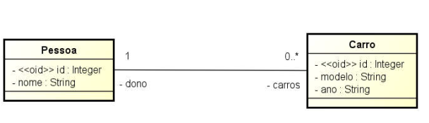

- Associações todo-parte
  - Agregação - diamante branco - mais fraca
  - Composição - diamante preto - mais forte - exclusiva (1 ou 0..1)
- Ressalvas
  - Use diamante somente quando realmente for uma associação todo-parte 
  - Não é a composição que indica deleção em cascata

---

RESUMO GEMINI

As associações **todo-parte** em UML são usadas para modelar relacionamentos onde uma classe (o "todo") é composta por, ou contém, instâncias de outra(s) classe(s) (as "partes"). Essas associações são fundamentais para representar a estrutura e a composição dos objetos em um sistema. Existem dois tipos principais: **Agregação** e **Composição**.

---

### Resumo do Tema: Associação Todo-Parte

Uma associação todo-parte descreve como um objeto "todo" é constituído por outros objetos "parte". A distinção principal entre os tipos de associação todo-parte reside na força do relacionamento e na dependência do ciclo de vida entre o todo e suas partes.

#### 1. Agregação (Aggregation) ⚪

A **agregação** representa uma relação "tem-um" ou "contém-um" mais fraca.
* **Características Principais:**
  * As partes podem existir independentemente do todo.
  * Se o "todo" for destruído, as "partes" podem continuar a existir e, potencialmente, ser associadas a outros "todos".
  * Uma "parte" pode ser compartilhada entre vários "todos" (embora isso deva ser modelado com cuidado para não gerar confusão).
* **UML:** Representada por um losango **vazado** (◇) no lado da classe "todo".
* **Quando usar:** Ideal para representar coleções de objetos onde a remoção do contêiner não implica na remoção dos objetos contidos.

**Exemplo UML (Agregação):** Uma `Universidade` possui `Departamentos`. Se a `Universidade` deixar de existir, os `Departamentos` podem, conceitualmente, continuar existindo ou serem incorporados por outra instituição. Um `Departamento` também pode agregar `Professores`.

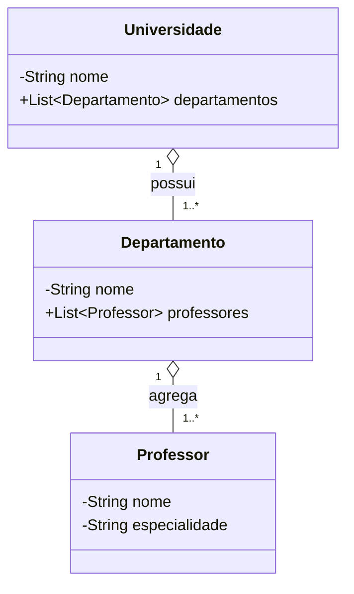

**Exemplo em Código Java (Agregação):**

```java
import java.util.ArrayList;
import java.util.List;

// Classe Parte
class Professor {
    private String nome;
    private String especialidade;

    public Professor(String nome, String especialidade) {
        this.nome = nome;
        this.especialidade = especialidade;
        System.out.println("Professor(a) " + nome + " (" + especialidade + ") criado(a).");
    }

    public String getNome() {
        return nome;
    }

    @Override
    public String toString() {
        return "Professor{" + "nome='" + nome + '\'' + ", especialidade='" + especialidade + '\'' + '}';
    }
}

// Classe Todo (que agrega Professores)
class Departamento {
    private String nome;
    private List<Professor> professores; // Agregação

    public Departamento(String nome) {
        this.nome = nome;
        this.professores = new ArrayList<>();
        System.out.println("Departamento de " + nome + " criado.");
    }

    public void adicionarProfessor(Professor professor) {
        this.professores.add(professor);
        System.out.println(professor.getNome() + " adicionado ao departamento de " + this.nome);
    }

    public void listarProfessores() {
        System.out.println("Professores do departamento de " + nome + ":");
        for (Professor p : professores) {
            System.out.println("- " + p.getNome());
        }
    }
    // Se o departamento for extinto, os professores (objetos) podem continuar existindo.
}

public class ExemploAgregacao {
    public static void main(String[] args) {
        Professor prof1 = new Professor("Dr. Silva", "Inteligência Artificial");
        Professor prof2 = new Professor("Dra. Costa", "Banco de Dados");

        Departamento deptComputacao = new Departamento("Ciência da Computação");
        deptComputacao.adicionarProfessor(prof1);
        deptComputacao.adicionarProfessor(prof2);

        deptComputacao.listarProfessores();

        // Mesmo que 'deptComputacao' seja descontinuado ou o objeto seja coletado pelo GC,
        // 'prof1' e 'prof2' ainda existem e podem ser associados a outros departamentos.
        // deptComputacao = null;
        // System.out.println(prof1); // prof1 ainda é uma instância válida.
    }
}
```

---

#### 2. Composição (Composition) ⚫

A **composição** representa uma relação de pertencimento forte, onde as "partes" são exclusivamente possuídas pelo "todo" e seu ciclo de vida é estritamente dependente dele.
* **Características Principais:**
  * As "partes" não existem independentemente do "todo".
  * Se o "todo" é destruído, as "partes" associadas também são destruídas.
  * Uma "parte" pertence a apenas um "todo" em um determinado momento.
* **UML:** Representada por um losango **preenchido** (◆) no lado da classe "todo".
* **Quando usar:** Para relações onde a parte é um componente intrínseco e exclusivo do todo. Garante forte integridade dos dados e do ciclo de vida.

**Exemplo UML (Composição):** Um `Livro` é composto por `Capítulos`. Se o `Livro` é destruído (ex: retirado de catálogo e todas as cópias físicas/digitais eliminadas), seus `Capítulos` deixam de existir como parte daquele livro. Um `Carro` é composto por um `Motor` específico.

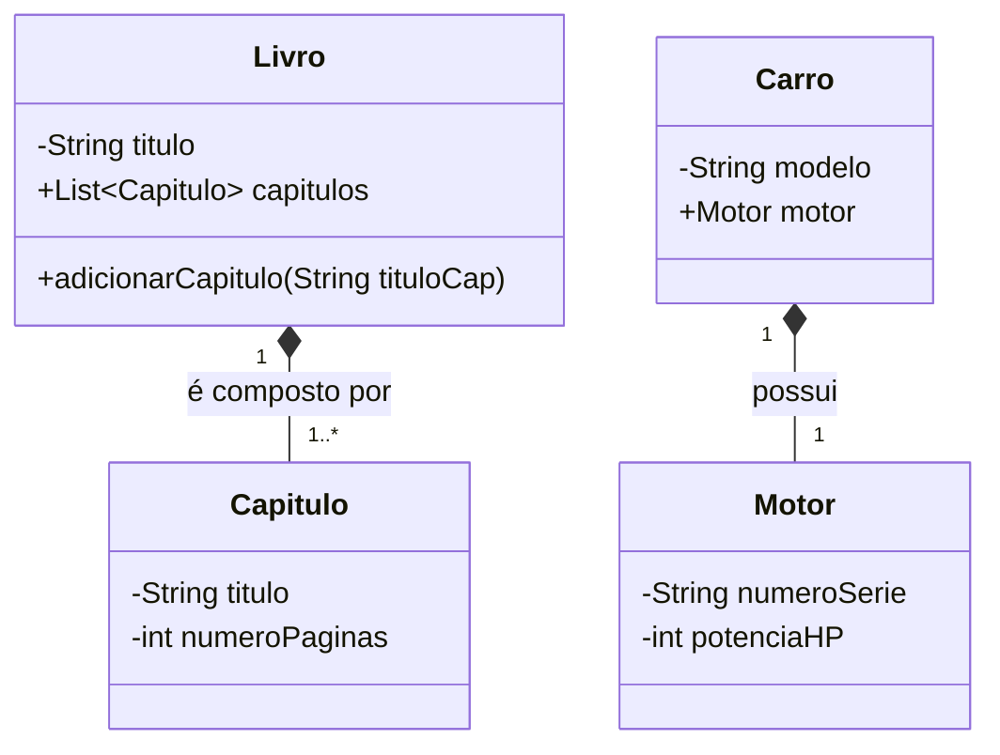

**Exemplo em Código Java (Composição):**

```java
import java.util.ArrayList;
import java.util.List;

// Classe Parte (ciclo de vida gerenciado pelo Livro)
class Capitulo {
    private String titulo;
    private int numeroPaginas;
    // Geralmente, a parte não tem uma referência explícita e navegável de volta ao todo
    // para reforçar a ideia de que é gerenciada pelo todo.

    // Construtor geralmente chamado pela classe "Todo"
    public Capitulo(String titulo, int numeroPaginas) {
        this.titulo = titulo;
        this.numeroPaginas = numeroPaginas;
        System.out.println("Capítulo '" + titulo + "' criado.");
    }

    public String getTitulo() {
        return titulo;
    }

    @Override
    public String toString() {
        return "Capitulo{" + "titulo='" + titulo + '\'' + ", paginas=" + numeroPaginas + '}';
    }
}

// Classe Todo
class Livro {
    private String titulo;
    private List<Capitulo> capitulos; // Composição

    public Livro(String titulo) {
        this.titulo = titulo;
        this.capitulos = new ArrayList<>(); // A lista de capítulos é criada com o livro
        System.out.println("Livro '" + titulo + "' criado.");
    }

    // O Livro é responsável pela criação de seus Capítulos
    public void adicionarCapitulo(String tituloCapitulo, int numPaginas) {
        Capitulo novoCapitulo = new Capitulo(tituloCapitulo, numPaginas);
        this.capitulos.add(novoCapitulo);
    }

    public void exibirSumario() {
        System.out.println("Sumário do Livro: " + titulo);
        for (int i = 0; i < capitulos.size(); i++) {
            System.out.println((i + 1) + ". " + capitulos.get(i).getTitulo());
        }
    }

    // Quando um objeto Livro é destruído (coletado pelo Garbage Collector, por exemplo),
    // os objetos Capitulo contidos em sua lista 'capitulos' também se tornarão
    // elegíveis para coleta, assumindo que não há outras referências a eles
    // (o que violaria a premissa da composição forte).
}

public class ExemploComposicao {
    public static void main(String[] args) {
        Livro meuLivro = new Livro("A Arte da Modelagem");
        meuLivro.adicionarCapitulo("Introdução", 10);
        meuLivro.adicionarCapitulo("Associações", 25);
        meuLivro.adicionarCapitulo("Herança", 15);

        meuLivro.exibirSumario();

        // Se 'meuLivro' for tornado null e não houver outras referências,
        // os capítulos "Introdução", "Associações", "Herança" também
        // perderão sua referência primária e serão elegíveis para coleta de lixo.
        // meuLivro = null;
    }
}
```

---

### Boas Práticas 👍 e Más Práticas 👎 para Associações Todo-Parte

#### Boas Práticas 👍:

1.  **Escolha Semântica Clara:** Decida entre agregação e composição com base no significado real da relação no domínio do problema. Pergunte-se: "A parte pode existir sem o todo?".
2.  **Gerenciamento do Ciclo de Vida (Composição):** Na composição, a classe "todo" deve gerenciar a criação e destruição de suas partes. Se o "todo" é deletado, as partes devem ser deletadas também.
3.  **Multiplicidades Corretas:** Defina as multiplicidades (cardinalidades) em ambos os lados da associação para refletir as regras de negócio (ex: um `Carro` *tem exatamente um* `Motor`; uma `Equipe` *tem muitos* `Jogadores`).
4.  **Coesão (Composição):** A composição ajuda a criar objetos mais coesos, onde o "todo" encapsula fortemente suas partes.
5.  **Clareza no Diagrama:** Use os símbolos UML corretos (losango vazado para agregação, preenchido para composição) para comunicar a intenção do design.

#### Más Práticas 👎:

1.  **Confundir Agregação com Composição:** Usar agregação quando a parte depende vitalmente do todo (ou vice-versa) pode levar a problemas de integridade de dados e objetos "órfãos".
2.  **Uso Excessivo de Composição:** Nem toda relação "tem-um" é uma composição. Aplicá-la indiscriminadamente pode tornar o modelo rígido e dificultar o reuso de componentes.
3.  **Agregação Trivial:** Usar agregação para relações que são meras associações simples sem uma clara semântica de "todo-parte". Por exemplo, `Cliente` e `Endereco` pode ser uma composição (se o endereço só existe para aquele cliente) ou uma associação simples (se endereços podem ser compartilhados ou existem independentemente).
4.  **Violar o Ciclo de Vida da Composição:** Permitir que "partes" de uma composição existam após a destruição do "todo" ou sejam compartilhadas entre múltiplos "todos" que as compõem.
5.  **Esquecer da Navegabilidade:** Embora não exclusivo de todo-parte, pense se a navegação é unidirecional (do todo para a parte) ou bidirecional, e represente isso adequadamente. Na composição, a navegação da parte para o todo é menos comum ou até desencorajada para reforçar a dependência.

Entender bem a diferença e a aplicação correta de agregação e composição é crucial para criar modelos de dados e de objetos robustos e significativos.


---

### 25 Classe de associação

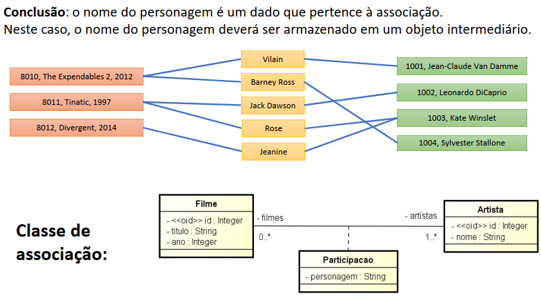

Atenção!

A classe de associação indica associação ÚNICA!

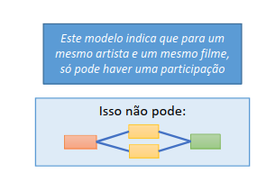


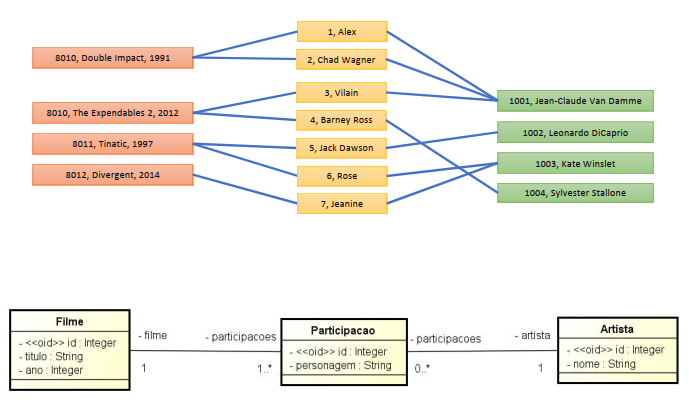

RESUMO

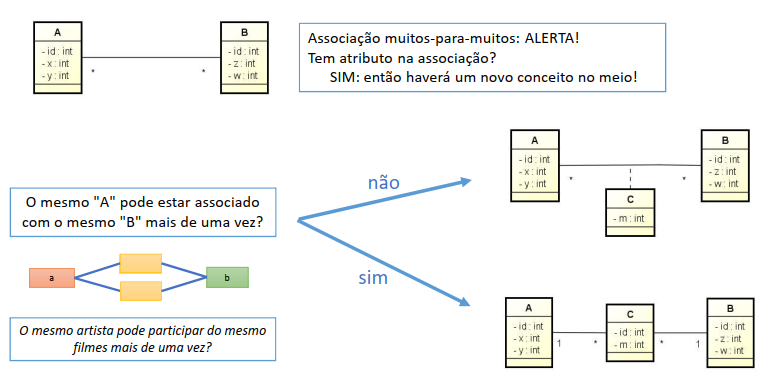


---
RESUMO GEMINI - Somente com o Tema da aula

Uma **Classe de Associação** é um construto da UML que permite que uma associação entre classes tenha seus próprios atributos e operações. Isso é útil quando certas informações não pertencem a nenhuma das classes individualmente, mas sim à relação entre elas.

---

### Resumo do Tema: Classe de Associação

Quando um relacionamento entre duas ou mais classes precisa armazenar informações ou comportamentos específicos, uma **Classe de Associação** é utilizada. Ela é, ao mesmo tempo, uma classe e uma associação.

* **Características Principais:**
  * Possui atributos e/ou operações que descrevem ou pertencem à relação.
  * É instanciada uma vez para cada link (instância da associação) entre os objetos das classes associadas.
  * É mais comum em associações muitos-para-muitos, mas pode ocorrer em outras multiplicidades se a semântica do domínio exigir.
* **UML:** Representada como uma classe normal conectada por uma linha tracejada à linha da associação que ela detalha.
* **Quando usar:** Sempre que você tiver dados ou comportamentos que são inerentes à interação ou ao vínculo entre objetos, e não aos objetos em si.

**Exemplo UML (Classe de Associação):** Um `Estudante` se matricula em uma `Turma`. A `Matricula` é a classe de associação que armazena a `dataMatricula` e a `notaFinal` do estudante naquela turma específica.

```mermaid
classDiagram
    Estudante "0..*" -- "0..*" Turma : matricula-se em
    (Estudante) .. (Matricula)
    (Turma) .. (Matricula)
    class Estudante {
        -String idEstudante
        -String nome
    }
    class Turma {
        -String codTurma
        -String disciplina
    }
    class Matricula {
        -Date dataMatricula
        -String status
        -double notaFinal
        +calcularStatusAprovacao()
    }
```

**Exemplo em Código Java (Classe de Associação):**

```java
import java.util.ArrayList;
import java.util.Date;
import java.util.List;

class Estudante {
    private String idEstudante;
    private String nome;
    // Opcional: Estudante pode manter uma lista de suas matrículas para facilitar a navegação
    private List<Matricula> matriculas;

    public Estudante(String idEstudante, String nome) {
        this.idEstudante = idEstudante;
        this.nome = nome;
        this.matriculas = new ArrayList<>();
    }

    public String getNome() {
        return nome;
    }

    public String getIdEstudante() {
        return idEstudante;
    }

    public void adicionarMatricula(Matricula matricula) {
        this.matriculas.add(matricula);
    }

    public List<Matricula> getMatriculas() {
        return matriculas;
    }

    @Override
    public String toString() {
        return "Estudante{" + "id='" + idEstudante + '\'' + ", nome='" + nome + '\'' + '}';
    }
}

class Turma {
    private String codTurma;
    private String disciplina;
    // Opcional: Turma pode manter uma lista de suas matrículas
    private List<Matricula> matriculas;

    public Turma(String codTurma, String disciplina) {
        this.codTurma = codTurma;
        this.disciplina = disciplina;
        this.matriculas = new ArrayList<>();
    }

    public String getDisciplina() {
        return disciplina;
    }

    public String getCodTurma() {
        return codTurma;
    }

    public void adicionarMatricula(Matricula matricula) {
        this.matriculas.add(matricula);
    }

    public List<Matricula> getMatriculas() {
        return matriculas;
    }

    @Override
    public String toString() {
        return "Turma{" + "cod='" + codTurma + '\'' + ", disciplina='" + disciplina + '\'' + '}';
    }
}

// Classe de Associação: Matricula
class Matricula {
    private Estudante estudante; // Referência ao Estudante
    private Turma turma;       // Referência à Turma
    private Date dataMatricula;
    private String status;
    private double notaFinal;

    public Matricula(Estudante estudante, Turma turma, Date dataMatricula) {
        this.estudante = estudante;
        this.turma = turma;
        this.dataMatricula = dataMatricula;
        this.status = "Cursando"; // Status inicial

        // Adiciona esta matrícula às listas do estudante e da turma para navegação bidirecional
        estudante.adicionarMatricula(this);
        turma.adicionarMatricula(this);
        System.out.println("Matrícula realizada para " + estudante.getNome() + " na turma " + turma.getCodTurma());
    }

    public Estudante getEstudante() {
        return estudante;
    }

    public Turma getTurma() {
        return turma;
    }

    public Date getDataMatricula() {
        return dataMatricula;
    }

    public String getStatus() {
        return status;
    }

    public void setStatus(String status) {
        this.status = status;
    }

    public double getNotaFinal() {
        return notaFinal;
    }

    public void setNotaFinal(double notaFinal) {
        this.notaFinal = notaFinal;
    }

    public String calcularStatusAprovacao() {
        if (notaFinal >= 7.0) {
            return "Aprovado";
        } else if (notaFinal >= 5.0) {
            return "Recuperação";
        } else {
            return "Reprovado";
        }
    }

    @Override
    public String toString() {
        return "Matricula{" +
               "estudante=" + estudante.getNome() +
               ", turma=" + turma.getCodTurma() + " (" + turma.getDisciplina() + ")" +
               ", data=" + dataMatricula +
               ", nota=" + notaFinal +
               ", status='" + status + '\'' +
               '}';
    }
}

public class ExemploClasseAssociacao {
    public static void main(String[] args) {
        Estudante aluno1 = new Estudante("E001", "Ana Clara");
        Estudante aluno2 = new Estudante("E002", "Bruno Dias");

        Turma turmaADS = new Turma("T01", "Análise e Des. de Sistemas");
        Turma turmaLogica = new Turma("T02", "Lógica de Programação");

        // Criando instâncias da classe de associação
        Matricula mat1 = new Matricula(aluno1, turmaADS, new Date());
        mat1.setNotaFinal(8.5);
        mat1.setStatus(mat1.calcularStatusAprovacao());


        Matricula mat2 = new Matricula(aluno1, turmaLogica, new Date());
        mat2.setNotaFinal(6.0);
        mat2.setStatus(mat2.calcularStatusAprovacao());

        Matricula mat3 = new Matricula(aluno2, turmaADS, new Date());
        mat3.setNotaFinal(9.0);
        mat3.setStatus(mat3.calcularStatusAprovacao());

        System.out.println("\nDetalhes das Matrículas:");
        System.out.println(mat1);
        System.out.println(mat2);
        System.out.println(mat3);

        System.out.println("\nMatrículas de " + aluno1.getNome() + ":");
        for (Matricula m : aluno1.getMatriculas()) {
            System.out.println("- Turma: " + m.getTurma().getDisciplina() + ", Nota: " + m.getNotaFinal() + ", Status: " + m.getStatus());
        }
    }
}
```

---

### Boas Práticas 👍 e Más Práticas 👎 para Classes de Associação

#### Boas Práticas 👍:

1.  **Use para Atributos da Relação:** Crie uma classe de associação quando a relação entre duas classes tem atributos próprios que não se encaixam bem em nenhuma das classes individualmente (ex: `dataContratacao` em uma relação `Empregado` -- `Projeto`).
2.  **Comportamento da Relação:** Utilize também se a relação tiver operações específicas (ex: `calcularComissao()` na relação `Vendedor` -- `Venda`).
3.  **Clareza em Muitos-para-Muitos:** Elas são especialmente úteis para resolver associações muitos-para-muitos, transformando-as em duas associações um-para-muitos com a classe de associação no meio. Isso é crucial em modelagem de banco de dados relacional.
4.  **Nome Significativo:** Dê um nome à classe de associação que descreva claramente o que ela representa na relação (ex: `Inscricao`, `ItemDePedido`, `Contrato`).
5.  **Multiplicidade Clara:** A classe de associação tem, implicitamente, uma multiplicidade de '1' para cada "lado" da associação original que ela detalha. As classes originais mantêm suas multiplicidades na associação principal.

#### Más Práticas 👎:

1.  **Uso Desnecessário:** Evite criar uma classe de associação se os atributos puderem pertencer logicamente a uma das classes da associação, especialmente em relações um-para-um ou um-para-muitos, onde o atributo pode ficar do lado "muitos" ou em qualquer um dos lados em um-para-um. Isso pode complicar o modelo sem necessidade.
  * *Exemplo Ruim:* Se uma `Pessoa` tem um único `TelefonePrincipal`, e o telefone tem um atributo `dataDeAtivacao` que é específico para aquela pessoa e aquele telefone, essa `dataDeAtivacao` poderia estar na classe `Telefone` ou, se `Telefone` for uma classe com muitos atributos, a relação entre `Pessoa` e `Telefone` poderia ter esse atributo, mas uma classe de associação seria exagero.
2.  **Confundir com Entidade Intermediária Comum:** Não confunda uma classe de associação com uma entidade que simplesmente se relaciona com outras duas. A classe de associação *descreve a própria relação*. Se a "classe do meio" tem sua própria identidade e existência independente da relação, ela é apenas uma classe normal com duas associações.
3.  **Esquecer a Conexão Tracejada:** No diagrama UML, a classe de associação *deve* estar ligada à linha da associação com uma linha tracejada. Conectá-la diretamente às classes participantes como uma associação comum muda o significado.
4.  **Atribuir Responsabilidades Erradas:** Não coloque na classe de associação atributos ou operações que são claramente responsabilidade de uma das classes participantes.
5.  **Modelagem Excessiva:** Em alguns casos, especialmente se a "classe de associação" não tiver comportamento próprio significativo e poucos atributos, pode-se optar por "promover" os atributos para uma das entidades participantes (se a multiplicidade permitir) ou criar uma entidade de junção simples, principalmente ao mapear para bancos de dados.

Dominar o uso de classes de associação permite criar modelos mais ricos e precisos, capturando nuances importantes sobre como os objetos se relacionam.

---

RESUMO GEMINI - Com o PDF da aula

Ok! Com base na sua apostila, vou aprimorar a explicação sobre **Classes de Associação**, focando nos pontos levantados pelo material do professor.

Primeiro, a transcrição do conteúdo relevante da apostila:

### Transcrição da Apostila (Partes Relevantes)

**Página 1: Agenda** [cite: 1]
* Exemplo motivador
* Classe de associação em associações muitos-para-muitos
* Classe de associação vs. Classe comum [cite: 1]

**Página 2: Exemplo motivador** [cite: 2]
* "Deseja-se fazer um sistema para manter um cadastro de filmes e artistas (atores/atrizes), bem como a informação de qual artista atuou em cada filme." [cite: 2]
* (Imagem mostrando filmes e artistas, e um diagrama de classes inicial com `Filme` e `Artista` em uma relação muitos-para-muitos).

**Página 3: Problema** [cite: 4]
* "Além disso, desejo saber também o nome do personagem desempenhado por cada artista em cada filme." [cite: 4]
* (Imagens mostrando que adicionar o nome do personagem diretamente na lista de filmes ou artistas é "ERRADO").

**Página 4: Classe de associação**
* "Conclusão: o nome do personagem é um dado que pertence à associação." [cite: 6]
* "Neste caso, o nome do personagem deverá ser armazenado em um objeto intermediário." [cite: 7]
* (Diagrama UML mostrando `Filme` e `Artista` com uma classe de associação `Participacao` ligada à associação, contendo o atributo `personagem: String`).
* "Atenção! A classe de associação indica associação ÚNICA!" [cite: 9]
* "Este modelo indica que para um mesmo artista e um mesmo filme, só pode haver uma participação." [cite: 9]
* "Isso não pode: (diagrama ilustrando a impossibilidade de um mesmo artista ter múltiplas participações/personagens diferentes no mesmo filme COM ESTE MODELO ESPECÍFICO de classe de associação)."

**Página 5: Problema de Múltiplos Personagens**
* "Então como representar um modelo no qual um mesmo artista pode representar mais de um personagem em um mesmo filme?" [cite: 10] (Exemplo: "Double Impact" [cite: 11]).
* (Diagrama UML mostrando `Filme "1" -- "*" participacoes - Participacao - participacoes "*" -- "1" Artista`. A classe `Participacao` agora é uma classe comum no meio, com `<<oid>> id: integer` e `personagem: String`).

**Página 6: Resumo da aula** [cite: 12]
* "Associação muitos-para-muitos: ALERTA! Tem atributo na associação? SIM: então haverá um novo conceito no meio!" [cite: 13]
* "O mesmo 'A' pode estar associado com o mesmo 'B' mais de uma vez?" [cite: 14]
  * "não" -> (Diagrama com Classe de Associação padrão: A -- (C) -- B)
  * "sim" -> (Diagrama com Classe Intermediária: A --* C *-- B)
* "O mesmo artista pode participar do mesmo filmes mais de uma vez?" [cite: 14]

---

### Resumo e Análise do Tema (com base na apostila)

A apostila do professor introduz a **Classe de Associação** como uma solução para modelar atributos que pertencem à relação entre duas classes, especialmente em associações muitos-para-muitos. [cite: 2, 6] O exemplo central é a necessidade de registrar qual personagem (`personagem`) um `Artista` desempenhou em um `Filme`. [cite: 4, 7]

Um ponto crucial destacado é que uma **Classe de Associação padrão implica uma associação ÚNICA** entre as instâncias das classes conectadas. [cite: 9] Isso significa que, para um par específico de (`Filme`, `Artista`), só pode existir uma instância da classe de associação (no exemplo, uma `Participacao`). [cite: 9] Esse modelo é adequado quando um artista desempenha apenas um personagem em um determinado filme.

No entanto, a apostila avança para um cenário mais complexo: "E se um mesmo artista puder representar mais de um personagem no mesmo filme?" (como no filme "Double Impact"). [cite: 10, 11] Para esses casos, a classe de associação padrão não é suficiente devido à sua restrição de unicidade. A solução é transformar o "conceito no meio" (a antiga classe de associação) em uma **classe comum (ou entidade intermediária)**. [cite: 13] Esta classe intermediária terá sua própria identidade e se relacionará com as classes originais (`Filme` e `Artista`) através de duas associações um-para-muitos. [cite: 15] Isso permite que um mesmo artista tenha múltiplas participações (com personagens diferentes) no mesmo filme, pois cada participação será uma instância distinta da classe intermediária.

Portanto, a decisão entre usar uma classe de associação padrão ou uma classe intermediária depende da cardinalidade da relação e se um par de objetos (`A` e `B`) pode ter múltiplos "links" com atributos diferentes entre eles. [cite: 14]

### Exemplos UML (Mermaid) e Código Java

Vamos ilustrar os dois cenários apresentados na apostila:

#### Cenário 1: Associação ÚNICA (Classe de Associação Padrão)
Um artista desempenha no máximo um personagem por filme.

**Exemplo UML:**

```mermaid
classDiagram
    Filme "0..*" -- "0..*" Artista : atua em
    (Filme) .. (Participacao)
    (Artista) .. (Participacao)

    class Filme {
        +Integer idFilme
        +String titulo
        +Integer ano
    }
    class Artista {
        +Integer idArtista
        +String nome
    }
    class Participacao {
        +String personagem
        +getFilme() Filme
        +getArtista() Artista
    }
```

**Exemplo em Código Java:**

```java
import java.util.HashMap;
import java.util.Map;
import java.util.Objects;

class Filme {
    public Integer idFilme;
    public String titulo;
    public Integer ano;

    public Filme(Integer idFilme, String titulo, Integer ano) {
        this.idFilme = idFilme;
        this.titulo = titulo;
        this.ano = ano;
    }

    @Override
    public String toString() {
        return "Filme{" + "id=" + idFilme + ", titulo='" + titulo + '\'' + ", ano=" + ano + '}';
    }

    // hashCode e equals para uso em chaves de Map
    @Override
    public boolean equals(Object o) {
        if (this == o) return true;
        if (o == null || getClass() != o.getClass()) return false;
        Filme filme = (Filme) o;
        return Objects.equals(idFilme, filme.idFilme);
    }

    @Override
    public int hashCode() {
        return Objects.hash(idFilme);
    }
}

class Artista {
    public Integer idArtista;
    public String nome;

    public Artista(Integer idArtista, String nome) {
        this.idArtista = idArtista;
        this.nome = nome;
    }

     @Override
    public String toString() {
        return "Artista{" + "id=" + idArtista + ", nome='" + nome + '\'' + '}';
    }

    // hashCode e equals
    @Override
    public boolean equals(Object o) {
        if (this == o) return true;
        if (o == null || getClass() != o.getClass()) return false;
        Artista artista = (Artista) o;
        return Objects.equals(idArtista, artista.idArtista);
    }

    @Override
    public int hashCode() {
        return Objects.hash(idArtista);
    }
}

// Classe de Associação Padrão
class Participacao {
    private Filme filme;
    private Artista artista;
    public String personagem;

    public Participacao(Filme filme, Artista artista, String personagem) {
        this.filme = filme;
        this.artista = artista;
        this.personagem = personagem;
    }

    public Filme getFilme() { return filme; }
    public Artista getArtista() { return artista; }

    @Override
    public String toString() {
        return "Participacao{" + artista.nome + " como '" + personagem + "' em '" + filme.titulo + "'}";
    }
}

// Gerenciador para garantir a unicidade da participação (Filme, Artista)
class SistemaFilmesUnico {
    // Chave composta para garantir unicidade
    static class ParFilmeArtista {
        Filme filme;
        Artista artista;

        ParFilmeArtista(Filme filme, Artista artista) {
            this.filme = filme;
            this.artista = artista;
        }

        @Override
        public boolean equals(Object o) {
            if (this == o) return true;
            if (o == null || getClass() != o.getClass()) return false;
            ParFilmeArtista that = (ParFilmeArtista) o;
            return Objects.equals(filme, that.filme) && Objects.equals(artista, that.artista);
        }

        @Override
        public int hashCode() {
            return Objects.hash(filme, artista);
        }
    }

    private Map<ParFilmeArtista, Participacao> participacoes = new HashMap<>();

    public void adicionarParticipacao(Filme filme, Artista artista, String personagem) {
        ParFilmeArtista par = new ParFilmeArtista(filme, artista);
        if (participacoes.containsKey(par)) {
            System.out.println("ERRO: " + artista.nome + " já tem uma participação em " + filme.titulo);
            return;
        }
        Participacao p = new Participacao(filme, artista, personagem);
        participacoes.put(par, p);
        System.out.println("Adicionado: " + p);
    }

    public Participacao getParticipacao(Filme filme, Artista artista) {
        return participacoes.get(new ParFilmeArtista(filme, artista));
    }
}

public class ExemploClasseAssociacaoUnica {
    public static void main(String[] args) {
        Filme f1 = new Filme(8010, "The Expendables 2", 2012);
        Filme f2 = new Filme(8011, "Titanic", 1997);
        Artista a1 = new Artista(1001, "Jean-Claude Van Damme");
        Artista a2 = new Artista(1002, "Leonardo DiCaprio");

        SistemaFilmesUnico sistema = new SistemaFilmesUnico();
        sistema.adicionarParticipacao(f1, a1, "Vilain");
        sistema.adicionarParticipacao(f2, a2, "Jack Dawson");
        
        // Tentativa de adicionar a mesma participação (deve falhar ou ser ignorada pela lógica da unicidade)
        System.out.println("\nTentando adicionar participação duplicada:");
        sistema.adicionarParticipacao(f1, a1, "Outro Personagem"); // Não deveria permitir segundo a regra de unicidade

        System.out.println("\nParticipação de Van Damme em Expendables 2: " + sistema.getParticipacao(f1, a1).personagem);
    }
}
```

#### Cenário 2: Múltiplas Associações/Papéis (Classe Intermediária)
Um artista pode desempenhar vários personagens no mesmo filme. [cite: 10]

**Exemplo UML:**

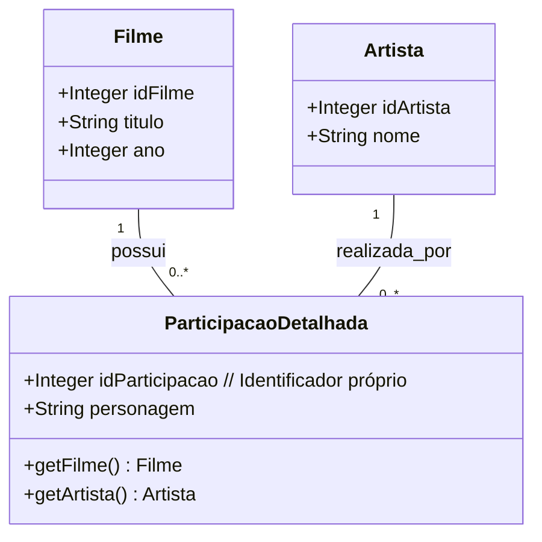

**Exemplo em Código Java:**

```java
import java.util.ArrayList;
import java.util.List;

// Classes Filme e Artista podem ser as mesmas do exemplo anterior

class ParticipacaoDetalhada {
    private static int proximoId = 1;
    public Integer idParticipacao;
    public Filme filme; // Referência ao filme
    public Artista artista; // Referência ao artista
    public String personagem;

    public ParticipacaoDetalhada(Filme filme, Artista artista, String personagem) {
        this.idParticipacao = proximoId++;
        this.filme = filme;
        this.artista = artista;
        this.personagem = personagem;
    }

    @Override
    public String toString() {
        return "ParticipacaoDetalhada{" + "id=" + idParticipacao + ", filme=" + filme.titulo + 
               ", artista=" + artista.nome + ", personagem='" + personagem + '\'' + '}';
    }
}

class SistemaFilmesMultipla {
    private List<ParticipacaoDetalhada> todasParticipacoes = new ArrayList<>();

    public void adicionarParticipacao(Filme filme, Artista artista, String personagem) {
        ParticipacaoDetalhada p = new ParticipacaoDetalhada(filme, artista, personagem);
        todasParticipacoes.add(p);
        System.out.println("Adicionado: " + p);
    }

    public void listarParticipacoesPorFilme(Filme filme) {
        System.out.println("\nParticipações em " + filme.titulo + ":");
        for (ParticipacaoDetalhada p : todasParticipacoes) {
            if (p.filme.equals(filme)) {
                System.out.println("- " + p.artista.nome + " como " + p.personagem);
            }
        }
    }
}

public class ExemploClasseIntermediaria {
    public static void main(String[] args) {
        Filme filmeDI = new Filme(8010, "Double Impact", 1991); // Exemplo da apostila [cite: 11]
        Artista artistaJCVD = new Artista(1001, "Jean-Claude Van Damme");

        SistemaFilmesMultipla sistema = new SistemaFilmesMultipla();

        // JCVD interpreta dois personagens no mesmo filme
        sistema.adicionarParticipacao(filmeDI, artistaJCVD, "Alex Wagner");
        sistema.adicionarParticipacao(filmeDI, artistaJCVD, "Chad Wagner");

        sistema.listarParticipacoesPorFilme(filmeDI);
    }
}
```

---

### Boas e Más Práticas (reforçadas pela apostila)

#### Boas Práticas 👍:

1.  **Atributos da Relação:** Use uma classe (de associação ou intermediária) quando a *relação* entre duas entidades tem atributos próprios. [cite: 6, 13] (Ex: `personagem` na relação `Filme`-`Artista`).
2.  **Resolver Muitos-para-Muitos:** É a forma padrão de lidar com atributos em associações N-M. [cite: 13]
3.  **Clareza na Unicidade vs. Multiplicidade da Relação:**
  * Se um par (A, B) tem **apenas uma** instância da relação com atributos, uma **Classe de Associação padrão** é adequada. [cite: 9]
  * Se um par (A, B) pode ter **múltiplas** instâncias da relação, cada uma com seus atributos (ex: mesmo artista, mesmo filme, múltiplos personagens), use uma **Classe Intermediária** com identidade própria e duas relações 1-N. [cite: 10, 14, 15]
4.  **Nome Significativo:** Dê nomes que reflitam o papel da classe na relação (ex: `Participacao`, `Matricula`, `ItemContrato`).

#### Más Práticas 👎:

1.  **Uso Desnecessário:** Se os atributos podem pertencer claramente a uma das classes da associação (comum em relações 1-1 ou 1-N), evite a classe de associação para não complicar o modelo.
2.  **Confundir o Modelo de Unicidade:** Aplicar o modelo de classe de associação padrão (que implica unicidade do link) quando a regra de negócio permite múltiplos links caracterizados entre o mesmo par de instâncias. [cite: 9, 10] Isso levaria a um modelo incorreto.
3.  **Esquecer a Identidade da Classe Intermediária:** Ao optar pelo modelo de classe intermediária para permitir múltiplas participações, é fundamental que essa classe tenha sua própria identidade (um `idParticipacao`, por exemplo), distinguindo cada instância de participação.
4.  **Modelar como Classe Comum sem Necessidade:** Se a relação é estritamente única para o par (A,B) e a classe de associação não tem outras associações complexas, a notação de classe de associação padrão (com linha tracejada) pode ser mais expressiva da semântica do que criar uma classe intermediária comum.

--- 

### 26 Exercícios de fixação

[04-E01+exercicios-fixacao-todo-parte-classe-de-associacao.pdf](Secao-04-Associacaes-todo-parte-e-classes-de-associacao/00-apoio/04-E01%2Bexercicios-fixacao-todo-parte-classe-de-associacao.pdf)

### 27 Exercício resolvido 1 - Parte 1/3

Exercício 1 (RESOLVIDO): Deseja-se fazer um sistema para armazenar as informações de uma locadora de jogos digitais. Cada jogo pode rodar em mais de uma plataforma (Xbox, PS3, PS4, PC, etc.). Cada jogo possui seu preço diário de locação, sendo que um mesmo jogo pode ter preços de locação diferentes para cada plataforma. Quando um cliente (nome, email, telefone, senha) deseja fazer uma locação, ele informa quais jogos ele quer locar, informando inclusive de qual plataforma é cada jogo contido na locação a ser realizada. Quando a locação é realizada, a data atual deve ser registrada para esta locação. Para cada jogo locado, o cliente informa quantos dias ele deseja ficar com cada um (note que ele pode alugar, por exemplo, um jogo X da plataforma Xbox por 2 dias e um jogo Y da plataforma PC por 5 dias, tudo para a mesma locação). A locadora também possui alguns consoles de vídeo game, os quais podem ser usados no local pelos clientes por um certo intervalo de tempo. Cada console possui um preço por cada hora (ou fração) utilizada, e contém um conjunto de acessórios (headphone, controle, Kinect, etc.).

Instância mínima: 2 plataformas, 2 jogos para cada plataforma, 2 clientes, 2 locações, 2 itens para cada locação, 2 consoles, pelo menos um console com mais de um acessório, pelo menos um cliente com mais de uma utilização de console.


### 28 Exercício resolvido 1 - Parte 2/3


### 29 Exercício resolvido 1 - Parte 3/3


### 30 Correção do exercício 2

Exercício 2: Deseja-se construir um sistema acadêmico. Para isso, são registrados os cursos disponíveis, onde cada um possui um nome, carga horária e valor. Quando um curso vai ser oferecido, é registrada uma turma, informando os seguintes dados: número da turma, data de início e número de vagas. Uma matrícula de um aluno em uma turma consiste na data de matrícula e no número de prestações em que o aluno vai pagar o curso. Para cada aluno, é necessário cadastrar seu nome, cpf, e data de nascimento. Cada aluno passa por várias avaliações durante o desenrolar do curso que está cursando. Uma avaliação possui nota e data. Depois que a avaliação ocorre, é registrado resultado de cada aluno da turma (a nota que ele tirou). Um aluno é aprovado em um curso se sua nota total for maior ou igual à nota mínima de aprovação prevista para o curso.

Instância mínima: 1 curso, 1 turma, 2 matrículas e 2 avaliações com resultados.

### 31 Correção do exercício 3

Exercício 3: Uma biblioteca deseja fazer o registro de seus empréstimos de livros. Quando um usuário pega um livro emprestado, deve ser registrada a data de empréstimo. Por padrão, o prazo de empréstimo é de dois dias, considerando atraso se o livro for devolvido depois deste tempo. Cada livro possui um título, gênero, editora e número de páginas. Um livro pode participar de uma coleção. Cada livro também possui um valor diário de multa, caso o usuário devolva o livro com atraso em relação à data prevista de devolução.

Instância mínima: 3 livros, 1 usuário, 2 empréstimos. Pelo menos um livro participando de uma coleção.


[Voltar ao Índice](#indice)

---


## <a name="parte5">5 - Seção 5 - Herança, Enumerações e Tipos Primitivos</a>


[Voltar ao Índice](#indice)

---


## <a name="parte6">6 - Seção 6 - Estudo de caso: Implementação Java com Spring Boot e JPA</a>


[Voltar ao Índice](#indice)

---


## <a name="parte7">7 - Seção 7 - Seção bônus</a>


[Voltar ao Índice](#indice)

---
